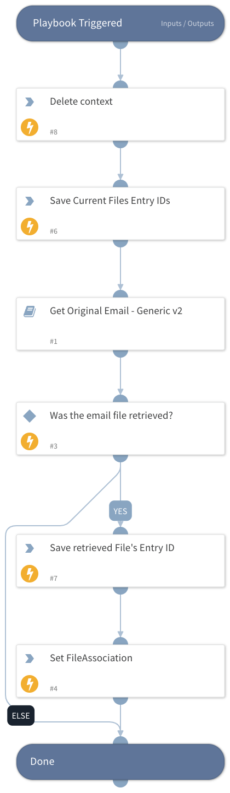

When the **Get Original Email - Generic v2** playbook is looped, there is no actual way to distinguish which retrieved file is related to which Message-ID. In order to solve this issue, this playbook will be looped instead and will output the "FileAssociation" key with the File-MessageID association.

## Dependencies
This playbook uses the following sub-playbooks, integrations, and scripts.

### Sub-playbooks
Get Original Email - Generic v2

### Integrations
This playbook does not use any integrations.

### Scripts
* DeleteContext
* SetAndHandleEmpty

### Commands
This playbook does not use any commands.

## Playbook Inputs
---

| **Name** | **Description** | **Default Value** | **Required** |
| --- | --- | --- | --- |
| MessageID | The original email message ID to retrieve. This should hold the value of the "Message-ID" header of the original email. |  | Optional |
| UserID | The email address of the user to fetch the original email for. For Gmail, the authenticated user. |  | Optional |
| EmailBrand | If this value is provided, only the relevant playbook runs. If no value is provided, all sub-playbooks are run. Possible values: - Gmail - EWS v2 - EWSO365 - MicrosoftGraphMail - EmailSecurityGateway  Choosing EmailSecurityGateway executes the following if enabled:     - FireEye EX \(Email Security\)     - Proofpoint TAP     - Mimecast |  | Optional |

## Playbook Outputs
---

| **Path** | **Description** | **Type** |
| --- | --- | --- |
| FileAssociation | When this playbook is looped, the EntryID of each retrieved eml file would be saved alongside the associated Message-ID inside the "FileAssociation" context key. | string |
| FileAssociation.EntryID | The retrieved file EntryID. When this playbook is looped, the EntryID of each retrieved eml file would be saved alongside the associated Message-ID inside the "FileAssociation" context key. | string |
| FileAssociation.MessageID | The retrieved email Message-ID. When this playbook is looped, the EntryID of each retrieved eml file would be saved alongside the associated Message-ID inside the "FileAssociation" context key. | string |
| File | The original email attachments. | string |

## Playbook Image
---

