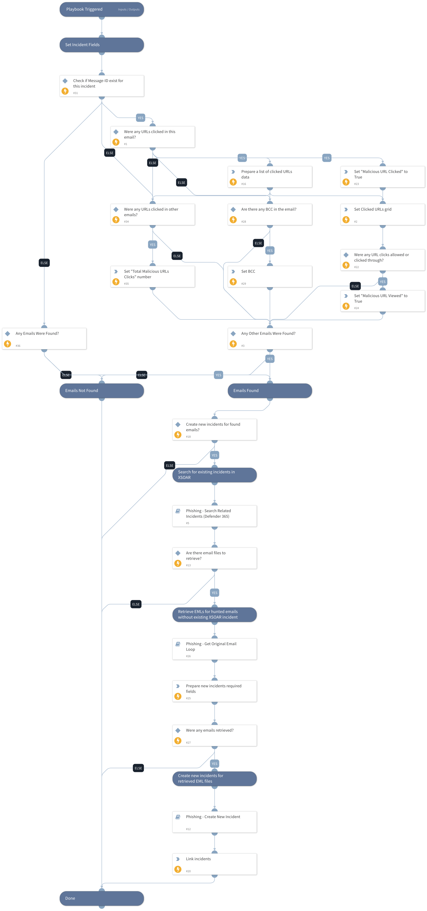

This playbook is used to handle the results from the "Microsoft 365 Defender - Threat Hunting Generic" playbook inside a phishing incident. It will do the following actions:
1) Set the relevant incident fields based on the results, such as "Clicked URLs", "Malicious URL Viewed" and "Malicious URL Clicked".
2) In case the relevant playbook inputs were configured, it will create new incidents for each email returned in the results. First, it will try to retrieve the original emails' files and then it will create an incident for each retrieved email.
3) Link the newly created incidents to the main originating incident.

Note that this playbook should only be used inside a phishing incident and not as a main playbook.

## Dependencies
This playbook uses the following sub-playbooks, integrations, and scripts.

### Sub-playbooks
* Phishing - Create New Incident
* Phishing - Search Related Incidents (Defender 365)
* Phishing - Get Original Email Loop

### Integrations
This playbook does not use any integrations.

### Scripts
* SetAndHandleEmpty
* SetGridField

### Commands
* linkIncidents
* setIncident

## Playbook Inputs
---

| **Name** | **Description** | **Default Value** | **Required** |
| --- | --- | --- | --- |
| RetrievedEmails | Emails retrieved by the "Microsoft 365 Defender - Threat Hunting Generic" playbook. |  | Required |
| CreateNewIncidents | When "True", the playbook will create new phishing incidents for each email that contains one of the malicious indicators. Default is "False" | False | Optional |
| EmailBrand | In order to retrieve email files in case any emails containing malicious indicators were found, this playbook would run the "Phishing - Get Original Email Loop" sub-playbook that will loop in order to retrieve all of the found emails. It will internally run the "Get Original Email - Generic v2" playbook that will use this input in order to run the relevant "Get Original Email" playbook based on the selected brand.   Possible values: - EWS v2 - EWSO365 - MicrosoftGraphMail  Default is "MicrosoftGraphMail". | MicrosoftGraphMail | Optional |

## Playbook Outputs
---

| **Path** | **Description** | **Type** |
| --- | --- | --- |
| FileAssociation | When this playbook is looped, there is no actual way to distinguish which retrieved file is related to which Message-ID. In order to solve this issue, the EntryID would be saved alongside the Message-ID inside the "FileAssociation" context key. | string |
| EmailFilesRetrieval | The emails to be retrieved. | string |

## Playbook Image
---

