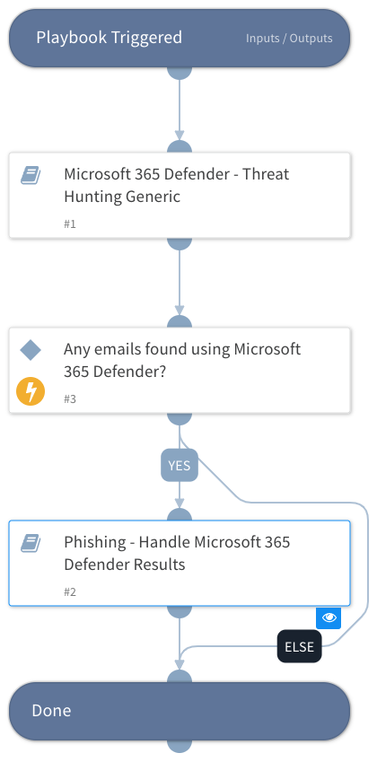

Hunt indicators related to phishing with available integrations and then handle the results. Handling the results will include setting relevant incident fields that will be displayed in the layout and optionally, opening new incidents according to the findings.
Current integration in this playbook:
Microsoft 365 Defender (using "Advanced Hunting")

Note that this playbook should be used as a sub-playbook inside a phishing incident and not as a main playbook.

## Dependencies
This playbook uses the following sub-playbooks, integrations, and scripts.

### Sub-playbooks
* Microsoft 365 Defender - Threat Hunting Generic
* Phishing - Handle Microsoft 365 Defender Results

### Integrations
This playbook does not use any integrations.

### Scripts
This playbook does not use any scripts.

### Commands
This playbook does not use any commands.

## Playbook Inputs
---

| **Name** | **Description** | **Default Value** | **Required** |
| --- | --- | --- | --- |
| DBotScore | The DBotScore object containing these keys: - Indicator - Type - Score | DBotScore | Optional |
| EmailHuntingCreateNewIncidents | When "True", the "Phishing - Handle Microsoft 365 Defender Results" sub-playbook will create new phishing incidents for each email that contains one of the malicious indicators. Default is "False". | False | Optional |
| ListenerMailbox | The mailbox of the listening integration. In case it is provided, the emails found in it will be ignored. |  | Optional |

## Playbook Outputs
---
There are no outputs for this playbook.

## Playbook Image
---

