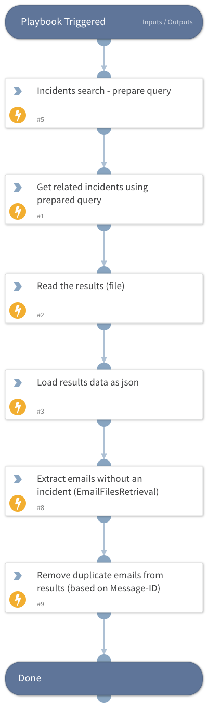

This playbook should only be used as a sub-playbook inside the "Phishing - Handle Microsoft 365 Defender Results" playbook.
It searches through existing Cortex XSOAR incidents based on retrieved email message IDs and returns data only for emails that ares not found in existing incidents.

## Dependencies
This playbook uses the following sub-playbooks, integrations, and scripts.

### Sub-playbooks
This playbook does not use any sub-playbooks.

### Integrations
This playbook does not use any integrations.

### Scripts
* GetIncidentsByQuery
* LoadJSON
* SetAndHandleEmpty
* ReadFile

### Commands
This playbook does not use any commands.

## Playbook Inputs
---

| **Name** | **Description** | **Default Value** | **Required** |
| --- | --- | --- | --- |
| RetrievedEmails | Emails retrieved by the "Microsoft 365 Defender - Threat Hunting Generic" playbook. |  | Optional |

## Playbook Outputs
---

| **Path** | **Description**                                                                                                        | **Type** |
| --- |------------------------------------------------------------------------------------------------------------------------| --- |
| EmailFilesRetrieval.Subject | The subject of the emails to be retrieved.                                                                             | string |
| EmailFilesRetrieval.InternetMessageId | The Message-ID of the emails to be retrieved.                                                                          | string |
| EmailFilesRetrieval.RecipientEmailAddress | The recipient email address of the emails to be retrieved.                                                             | string |
| EmailFilesRetrieval | An object containing the subject, internet message ID, and recipient email address of the emails to be retrieved. | string |

## Playbook Image
---

