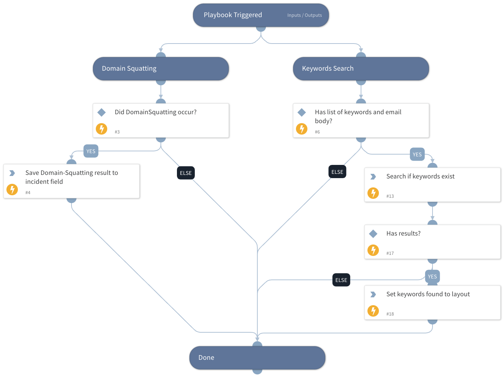

The "Spear Phishing Investigation" playbook is designed to detect patterns that indicates a spear phishing attempt by the attacker.

## Dependencies

This playbook uses the following sub-playbooks, integrations, and scripts.

### Sub-playbooks

This playbook does not use any sub-playbooks.

### Integrations

This playbook does not use any integrations.

### Scripts

MatchRegexV2

### Commands

setIncident

## Playbook Inputs

---

| **Name** | **Description** | **Default Value** | **Required** |
| --- | --- | --- | --- |
| DomainSquattingResults | Results of the domain squatting investigation. |  | Optional |
| KeywordsToSearch | A comma-separated list of keywords to search in the email body. For example: name of the organization finance app that the attacker might impersonate. |  | Optional |
| MailBody | The phishing mail body. |  | Optional |

## Playbook Outputs

---
There are no outputs for this playbook.

## Playbook Image

---

