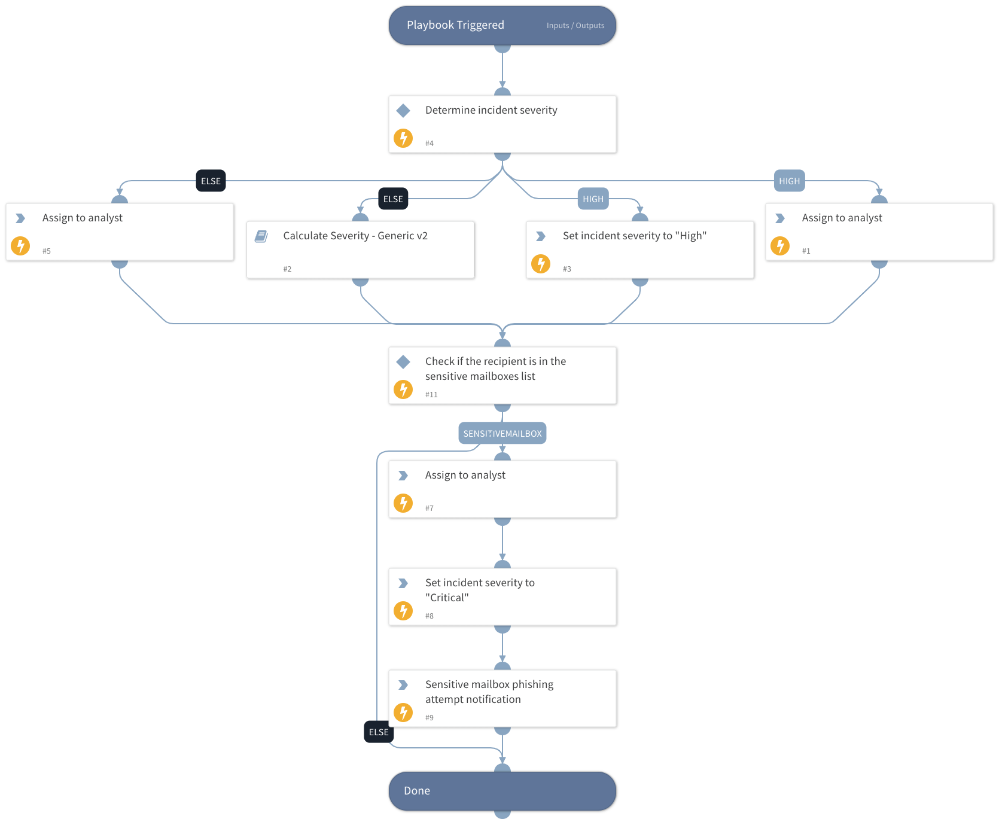

This playbook calculates and assigns the incident severity based on the highest returned severity level from the following calculations:
- Email security alert action
- DBotScores of indicators
- Critical assets
- Email authenticity
- Current incident severity
- Microsoft Headers

## Dependencies
This playbook uses the following sub-playbooks, integrations, and scripts.

### Sub-playbooks
Calculate Severity - Generic v2

### Integrations
This playbook does not use any integrations.

### Scripts
* AssignAnalystToIncident
* IncreaseIncidentSeverity

### Commands
* send-mail
* setIncident

## Playbook Inputs
---

| **Name** | **Description** | **Default Value** | **Required** |
| --- | --- | --- | --- |
| Role | The default role to assign the incident to. |  | Optional |
| escalationRole | The higher tier role to assign the incident to. |  | Optional |
| OnCall | Set to True to assign only to analysts on the current shift. |  | Optional |
| AuthenticityCheck | Indicates the email authenticity resulting from the EmailAuthenticityCheck script. Possible values are: Pass, Fail, Suspicious, and Undetermined. |  | Optional |
| MicrosoftHeadersSeverityCheck | This value is set by the "Process Microsoft's Anti-Spam Headers" playbook, which calculates the severity after processing the PCL, BCL and PCL values in Microsoft headers. |  | Optional |
| SOCEmailAddress | The SOC email address to set if the playbook handles an email security alert. |  | Optional |
| EmailTo | The email recipient. |  | Optional |
| blockedAlertActionValue | A comma-separated list of optional values the email security device returns for blocked\\denied\\etc. emails. |  | Optional |

## Playbook Outputs
---
There are no outputs for this playbook.

## Playbook Image
---

