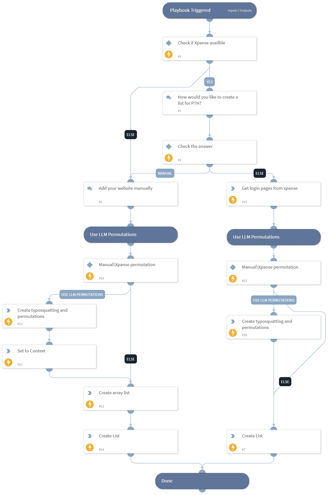

This playbook help analysts creating a new list of domains to monitor using CertStream integration.

## Dependencies

This playbook uses the following sub-playbooks, integrations, and scripts.

### Sub-playbooks

This playbook does not use any sub-playbooks.

### Integrations

* OpenAi ChatGPT v3

### Scripts

* CreateArray
* IsIntegrationAvailable

### Commands

* createList
* chatgpt-send-prompt
* asm-get-external-websites

## Playbook Inputs

---
There are no inputs for this playbook.

## Playbook Outputs

---
There are no outputs for this playbook.

## Playbook Image

---

