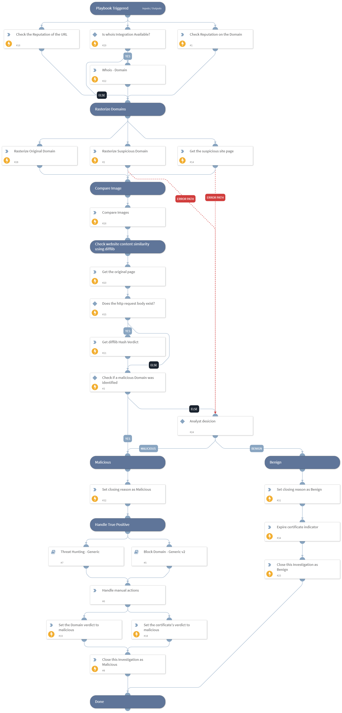

This playbook process "New Suspicious Domain" alerts generated by the CertStream integration.

## Dependencies

This playbook uses the following sub-playbooks, integrations, and scripts.

### Sub-playbooks

* Block Domain - Generic v2
* Threat Hunting - Generic

### Integrations

This playbook does not use any integrations.

### Scripts

* imagecompare
* HttpV2
* html_difflib_check
* Set
* IsIntegrationAvailable

### Commands

* url
* domain
* expireIndicators
* setIndicators
* whois
* closeInvestigation
* rasterize

## Playbook Inputs

---

| **Name** | **Description** | **Default Value** | **Required** |
| --- | --- | --- | --- |
| contactEmail | Email address to receive feedback from the domain registrant | oitzhak@paloaltonetworks.com | Optional |

## Playbook Outputs

---
There are no outputs for this playbook.

## Playbook Image

---

