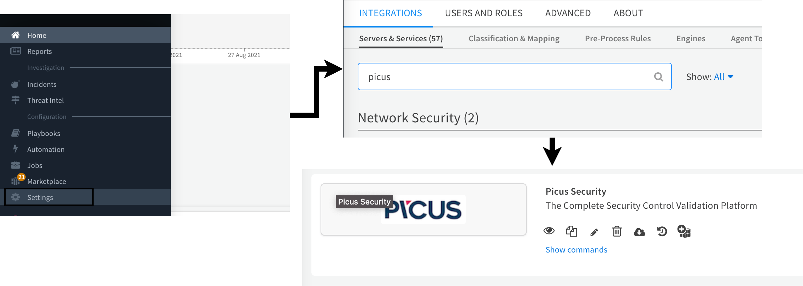
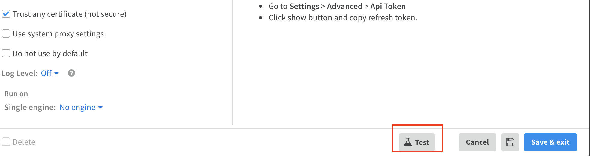

Run commands on Picus and automate security validation with playbooks.
This integration was integrated and tested with version 3976 of Picus

## Configure Picus in Cortex





| **Parameter** | **Description** | **Required** |
| --- | --- | --- |
| Picus Manager URL |  | True |
| Picus Refresh Token | The refresh token will be used to generate access token. | True |
| Trust any certificate (not secure) |  | False |
| Use system proxy settings |  | False |




## Commands
You can execute these commands from the CLI, as part of an automation, or in a playbook.
After you successfully execute a command, a DBot message appears in the War Room with the command details.
### picus-get-access-token
***
Generates an access token for API usage. This function used for other functions inner authentication mechanism. Looks for X-Refresh-Token on the header or refresh-token cookie.


#### Base Command

`picus-get-access-token`
#### Input

There are no input arguments for this command.

#### Context Output

There is no context output for this command.


### picus-get-vector-list
***
Returns the vector list from PICUS. These vectors can be used for automation processes.


#### Base Command

`picus-get-vector-list`
#### Input

| **Argument Name** | **Description** | **Required** |
| --- | --- | --- |
| add_user_details | Add vectors' assigned user details to the response. | Optional | 
| page | Requested page number. | Optional | 
| size | Requested data size. | Optional | 


#### Context Output

| **Path** | **Type** | **Description** |
| --- | --- | --- |
| Picus.vectorlist.description | String | Description info of the vector | 
| Picus.vectorlist.heartbeat_results.is_successful | Boolean | Was the heartbeat end successfully? | 
| Picus.vectorlist.heartbeat_results.module | String | On which module did the heartbeat executed? | 
| Picus.vectorlist.heartbeat_results.result_time | Date | When the heartbeat is executed? \(End time\) | 
| Picus.vectorlist.heartbeat_results.variant | String | On which variant did the heartbeat executed? | 
| Picus.vectorlist.is_disabled | Boolean | Is the vector status disabled? | 
| Picus.vectorlist.name | String | Name of the vector | 
| Picus.vectorlist.trusted | String | Trusted peer name | 
| Picus.vectorlist.type | String | Type of the vector, if error is encountered, "Unknown" is returned. Other valid values are: "Network", "Email, "Endpoint" | 
| Picus.vectorlist.untrusted | String | Untrusted peer name | 
| Picus.vectorlist.users | Unknown | Users assigned to this vector |


#### Command Example
```!picus-get-vector-list```

#### Human Readable Output

|Name|Trusted|Untrusted|Is Disabled|Type|
|---|---|---|---|---|
| Picus_Attacker_1 - Win10-Det1 | Win10-Det1 | Picus_Attacker_1 | true | Endpoint |
| Picus_Attacker_2 - Win10-Det2 | Win10-Det2 | Picus_Attacker_2 | true | Endpoint |


### picus-get-peer-list
***
Returns the peer list with current statuses. These peers also can be seen on the **PICUS Panel ->Settings-> Peers**.


#### Base Command

`picus-get-peer-list`
#### Input

There are no input arguments for this command.

#### Context Output

| **Path** | **Type** | **Description** |
| --- | --- | --- |
| Picus.peerlist.is_alive | Boolean | Is Peer Alive? | 
| Picus.peerlist.latest_attack | Date | Latest Attack Time of the Peer | 
| Picus.peerlist.name | String | Peer Name | 
| Picus.peerlist.registered_ip | String | IP of the peer | 
| Picus.peerlist.type | String | Peer's Type | 


#### Command Example
```!picus-get-peer-list```

#### Human Readable Output

|Name|Registered Ip|Type|Is Alive|
|---|---|---|---|
| Picus_Attacker_1 | x.x.x.x | Network | true |
| Picus_Attacker_2 | x.x.x.x | Network | true |
| Win10-Det2 | x.x.x.x | Endpoint | true |


### picus-get-attack-results
***
In the Picus, all attacks are carried out with the logic of the attacker and the victim. This command returns the list of the attack results on specified peers. Time range and result status can be given.


#### Base Command

`picus-get-attack-results`
#### Input

| **Argument Name** | **Description** | **Required** |
| --- | --- | --- |
| attacker_peer | Untrusted peer name. | Required | 
| victim_peer | Trusted peer name. | Required | 
| days | Set days parameter. Default is 3. | Optional | 
| result | This setting can only be insecure,secure and all. Default is all. | Optional | 


#### Context Output

| **Path** | **Type** | **Description** |
| --- | --- | --- |
| Picus.attackresults.results.threat_ids | String | Threat ID List | 
| Picus.attackresults.results.begin_time | Date | begin time of the attack | 
| Picus.attackresults.results.destination_port | Number | Value "0" indicates it is not applicable such as all vector types except network | 
| Picus.attackresults.results.end_time | Date | end time of the attack | 
| Picus.attackresults.results.id | Number | id | 
| Picus.attackresults.results.l1_category_name | String | Level 1 Category Name of the attack | 
| Picus.attackresults.results.scenario_details.action_id | Number | Action ID of the threat scenario action | 
| Picus.attackresults.results.scenario_details.action_name | String | Action Name of the threat scenario action | 
| Picus.attackresults.results.scenario_details.end | Date | The time attack ended | 
| Picus.attackresults.results.scenario_details.id | Number | Primary key | 
| Picus.attackresults.results.scenario_details.process_results | Unknown |  Process Results\(play and rewind\) | 
| Picus.attackresults.results.scenario_details.result | String | Final result of the scenario action | 
| Picus.attackresults.results.scenario_details.technique_id | String | Technique ID of the threat scenario action | 
| Picus.attackresults.results.source_port | Number | Value "0" indicates it is not applicable such as all vector types except network and wats attacks | 
| Picus.attackresults.results.string | String | Attack Result | 
| Picus.attackresults.results.threat_id | Number | Threat ID of the attack | 
| Picus.attackresults.results.threat_name | String | Threat Name of the attack | 
| Picus.attackresults.results.trusted | String | Trusted peer name | 
| Picus.attackresults.results.untrusted | String | Untrusted peer name | 
| Picus.attackresults.results.variant | String | Variant info | 


#### Command Example
```!picus-get-attack-results attacker_peer="Picus_Attacker_1" victim_peer="net1-det1" days=1 result="insecure"```

#### Human Readable Output

|Begin Time|End Time|String|Threat Id|Threat Name|
|---|---|---|---|---|
| 2021-09-16T23:59:54.738644627Z | 2021-09-16T23:59:54.753408649Z | Insecure | 206450 | HTML5 Web Storage Sensitive Data Exposure |
| 2021-09-16T23:52:52.022470123Z | 2021-09-16T23:52:52.077736344Z | Insecure | 206111 | Zeus PandaBanker Trojan .EXE File Download Variant-11 |


### picus-run-attacks
***
In the Picus, all attacks are carried out with the logic of the attacker and the victim. This command schedules a single attack on the requested vector.


#### Base Command

`picus-run-attacks`
#### Input

| **Argument Name** | **Description** | **Required** |
| --- | --- | --- |
| threat_ids | Threat ID list ("111,222,333,...") or single threat ID can be given. | Required | 
| attacker_peer | Untrusted peer name. | Required | 
| victim_peer | Trusted peer name. | Required | 
| variant | This parameter can be HTTP or HTTPS. Example variant=HTTP | Required | 


#### Context Output

| **Path** | **Type** | **Description** |
| --- | --- | --- |
| Picus.runattacks | String | IDs of the assessed attacks | 


#### Command Example
```!picus-run-attacks attacker_peer="Picus_Attacker_1" victim_peer="net1-det1" threat_ids="881728,879812,798283" variant="HTTP"```

#### Human Readable Output

|Threat Id|Result|
|---|---|
| 881728 | success |
| 879812 | success |
| 798283 | success |


### picus-get-threat-results
***
Returns the list of the attack results of a single threat have optional parameters for filtration.


#### Base Command

`picus-get-threat-results`
#### Input

| **Argument Name** | **Description** | **Required** |
| --- | --- | --- |
| threat_ids | Threat ID list ("111,222,333,...") or single threat ID can be given. | Required | 
| attacker_peer | Untrusted peer name. | Required | 
| victim_peer | Trusted peer name. | Required | 
| variant | This parameter can be HTTP or HTTPS. Example variant=HTTP | Required | 


#### Context Output

| **Path** | **Type** | **Description** |
| --- | --- | --- |
| Picus.threatresults.results.threat_results | String | Threat Results\(ID and result combination\) | 
| Picus.threatresults.results.l1_category | String | Level 1 Category Name of the attack | 
| Picus.threatresults.results.last_time | Date | Last Threat Result Time | 
| Picus.threatresults.results.result | String | Threat Result | 
| Picus.threatresults.results.status | String | Status | 
| Picus.threatresults.results.threat_id | Number | Threat ID of the attack | 


#### Command Example
```!picus-get-threat-results attacker_peer="Picus_Attacker_1" victim_peer="net1-det1" variant="HTTP" threat_ids="562172"```

#### Human Readable Output

|Threat Id|Result|L1 Category|Last Time|Status|
|---|---|---|---|---|
| 562172 | Secure | Vulnerability Exploitation | 2021-09-16T13:26:00.932298Z | success |


### picus-set-paramPB
***
Set parameter on the playbook. (This command is only used on playbook)


#### Base Command

`picus-set-paramPB`
#### Input

| **Argument Name** | **Description** | **Required** |
| --- | --- | --- |
| attacker_peer | Untrusted peer name. | Required | 
| victim_peer | Trusted peer name. | Required | 
| variant | This parameter can be HTTP or HTTPS. Example variant=HTTP | Required | 
| mitigation_product | Products info of the mitigation. This parameter can be Check Point NGFW, ForcepointNGFW, McAfee IPS, PaloAlto IPS, SourceFire IPS, TippingPoint, F5 BIG-IP, Fortigate WAF, FortiWeb, Fortigate IPS, Snort, CitrixWAF, and ModSecurity. | Required | 
| days | Set days parameter. Default is 3. | Optional |


#### Context Output

| **Path** | **Type** | **Description** |
| --- | --- | --- |
| Picus.param.attacker_peer | String | Untrusted peer name | 
| Picus.param.days | Number | days | 
| Picus.param.mitigation_product | String | Products info of the mitigation | 
| Picus.param.variant | String | This parameter can be HTTP or HTTPS. Example variant=HTTP | 
| Picus.param.victim_peer | String | Trusted peer name | 


### filter-insecure-attacks
***
Filter insecure attacks on the playbook. (This command is only used on playbook)


#### Base Command

`picus-filter-insecure-attacks`
#### Input

| **Argument Name** | **Description** | **Required** |
| --- | --- | --- |
| threatinfo | Threat id and result combine. Used for playbook. | Required | 


#### Context Output

| **Path** | **Type** | **Description** |
| --- | --- | --- |
| Picus.filterinsecure | String | Insecure Attack List | 


### picus-get-mitigation-list
***
Returns the list of the mitigations of threats have optional parameters for filtration, this route may not be used associated with your license.


#### Base Command

`picus-get-mitigation-list`
#### Input

| **Argument Name** | **Description** | **Required** |
| --- | --- | --- |
| threat_ids | Threat ID list ("111,222,333,...") or single threat ID can be given. | Required | 
| product | Products info of the mitigation. This parameter can be Check Point NGFW, ForcepointNGFW, McAfee IPS, PaloAlto IPS, SourceFire IPS, TippingPoint, F5 BIG-IP, Fortigate WAF, FortiWeb, Fortigate IPS, Snort, CitrixWAF, and ModSecurity. | Required | 


#### Context Output

| **Path** | **Type** | **Description** |
| --- | --- | --- |
| Picus.mitigationresults.signature_id | String | ID of the signature | 
| Picus.mitigationresults.signature_name | String | Name of the signature | 
| Picus.mitigationresults.threat_id | Number | Threat ID of Picus Attack | 
| Picus.mitigationresults.vendor | String | Product name of the mitigation | 


#### Command Example
```!picus-get-mitigation-list threat_ids="103847" product="Snort"```

#### Human Readable Output

|Threat Dd|Signature Id|Signature Name|
|---|---|---|
| 103847 | 1.2025644.1 | ET TROJAN Possible Metasploit Payload Common Construct Bind_API (from server) |
| 103847 | 1.44728.3 | INDICATOR-COMPROMISE Meterpreter payload download attempt |


### picus-get-vector-compare
***
Makes a comparison of the given vector's results.


#### Base Command

`picus-get-vector-compare`
#### Input

| **Argument Name** | **Description** | **Required** |
| --- | --- | --- |
| attacker_peer | Untrusted peer name. | Required | 
| victim_peer | Trusted peer name. | Required | 
| days | Set days parameter. Default is 3. | Optional | 


#### Context Output

| **Path** | **Type** | **Description** |
| --- | --- | --- |
| Picus.vectorresults.name | String | Name of Picus Attack | 
| Picus.vectorresults.status | String | Compare Result | 
| Picus.vectorresults.threat_id | String | Threat ID of Picus Attack | 


#### Command Example
```!picus-get-vector-compare attacker_peer="Picus_Attacker_1" victim_peer="net1-det1"```

#### Human Readable Output

|Status|Threat Id|Name|
|---|---|---|
| secure | 204923 | XSS Evasion via HTML Encoding Variant-4 |
| insecure | null | null |
| secure_to_insecures | null | null |
| insecure_to_secures | null | null |


### picus-version
***
Returns the current Picus version and the update time config.


#### Base Command

`picus-version`
#### Input

There are no input arguments for this command.

#### Context Output

| **Path** | **Type** | **Description** |
| --- | --- | --- |
| Picus.versioninfo.last_update_date | Date | When was the last update? | 
| Picus.versioninfo.update_time | Number | When to update? | 
| Picus.versioninfo.version | Number | Current version | 


#### Command Example
```!picus-version```

#### Human Readable Output

|Version|Update Time|Last Update Date|
|---|---|---|
| 4025 | 0 | 20.10.2021 |


### picus-trigger-update
***
Triggers the Picus product update mechanism manually.


#### Base Command

`picus-trigger-update`
#### Input

There are no input arguments for this command.

#### Context Output

| **Path** | **Type** | **Description** |
| --- | --- | --- |
| Picus.triggerupdate.data | Boolean | Collected data that will be returned | 
| Picus.triggerupdate.success | Boolean | Is the operation Succeed? | 


#### Command Example
```!picus-trigger-update```

#### Human Readable Output

|Data|Success|
|---|---|
| true | true |