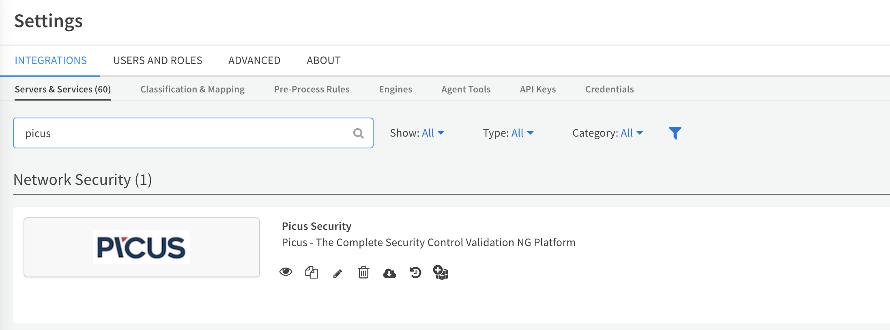
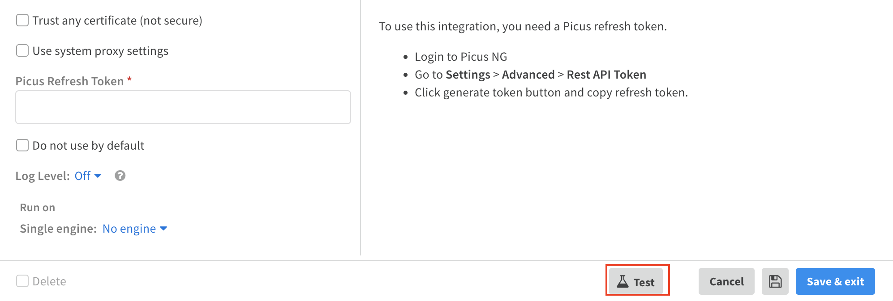

This integration was integrated and tested with Picus NG

## Configure PicusNG in Cortex

| **Parameter** | **Required** |
| --- | --- |
| Picus Manager URL | True |
| Trust any certificate (not secure) | False |
| Use system proxy settings | False |
| Picus Refresh Token | True |

## Commands
You can execute these commands from the CLI, as part of an automation, or in a playbook.
After you successfully execute a command, a DBot message appears in the War Room with the command details.
### picus-get-access-token
***
OAuth2 protocol is used to authorize Refresh/Access tokens. To obtain the API, you should generate a refresh token and then request an access token using this command.

#### Base Command

`picus-get-access-token`
#### Input

There are no input arguments for this command.

#### Context Output

There is no context output for this command.
### picus-get-agent-list
***
This command returns the simulation agent list with agent name, id, status, agent type and platform information as in Picus platform > Agents.

#### Base Command

`picus-get-agent-list`
#### Input

There are no input arguments for this command.

#### Context Output

There is no context output for this command.
### picus-get-agent-detail
***
This command returns agent name, status, agent type, platform and also mitigation devices and attack modules using the agent ID.

#### Base Command

`picus-get-agent-detail`
#### Input

| **Argument Name** | **Description** | **Required** |
| --- | --- | --- |
| id | Agent id. | Required | 

#### Context Output

There is no context output for this command.
### picus-create-simulation
***
This command creates and runs a simulation as requested; scheduled or instant.
You can create a simulation by giving your simulation a name and adding the template ID, agent ID.

#### Base Command

`picus-create-simulation`
#### Input

| **Argument Name** | **Description** | **Required** |
| --- | --- | --- |
| agent_id | ID of the agent. | Required | 
| description | Description of the simulation. Default is this simulation created with cortex app. | Optional | 
| name | Name of the simulation. | Required | 
| schedule_now | Schedule now state. Possible values are: True, False. | Required | 
| template_id | Id of the template. | Required | 

#### Context Output

There is no context output for this command.
### picus-get-template-list
***
This command returns template list that contains template name, id, description, content type, category as in Picus Platform> Threat Templates.

#### Base Command

`picus-get-template-list`
#### Input

| **Argument Name** | **Description** | **Required** |
| --- | --- | --- |
| offset | Pagination value. | Optional | 
| limit | Pagination value. | Optional | 

#### Context Output

There is no context output for this command.
### picus-get-integration-agent-list
***
This command returns the agent name, id, status, agent installation information and the token expiration information.

#### Base Command

`picus-get-integration-agent-list`
#### Input

There are no input arguments for this command.

#### Context Output

There is no context output for this command.
### picus-get-simulation-list
***
This command returns the list of you latest simulation result overview as in Picus Platform > Simulations tab. Latest simulation run results are included.

#### Base Command

`picus-get-simulation-list`
#### Input

| **Argument Name** | **Description** | **Required** |
| --- | --- | --- |
| offset | Pagination value. | Optional | 
| limit | Pagination value. | Optional | 

#### Context Output

| **Path** | **Type** | **Description** |
| --- | --- | --- |
| Picus.simulationlist.simulation_id | Number | ID of the simulation | 

### picus-simulate-now
***
This command runs the existing simulation using the Simulation ID.

#### Base Command

`picus-simulate-now`
#### Input

| **Argument Name** | **Description** | **Required** |
| --- | --- | --- |
| id | Simulation ID. | Required | 

#### Context Output

There is no context output for this command.
### picus-get-simulation-detail
***
This command returns the information about a specific simulation.

#### Base Command

`picus-get-simulation-detail`
#### Input

| **Argument Name** | **Description** | **Required** |
| --- | --- | --- |
| id | Simulation ID. | Required | 

#### Context Output

There is no context output for this command.
### picus-get-latest-simulation-result
***
This command returns detailed information about simulation results including Prevention and Detection result details for the latest simulation run.

#### Base Command

`picus-get-latest-simulation-result`
#### Input

| **Argument Name** | **Description** | **Required** |
| --- | --- | --- |
| id | Simulation ID. | Required | 

#### Context Output

| **Path** | **Type** | **Description** |
| --- | --- | --- |
| Picus.latestSimulationResult.simulation_run_id | String | Simulation Run ID | 
| Picus.latestSimulationResult.simulation_id | String | Simulation ID | 
| Picus.latestSimulationResult.status | String | Simulation Status | 

### picus-get-simulation-result
***
This command returns detailed information about simulation results including Prevention and Detection result details for a specific simulation run with run id.

#### Base Command

`picus-get-simulation-result`
#### Input

| **Argument Name** | **Description** | **Required** |
| --- | --- | --- |
| id | Simulation ID. | Required | 
| run_id | Simulation Run ID. | Required | 

#### Context Output

There is no context output for this command.
### picus-get-simulation-threats
***
This command returns simulation result based on threats. Threat result includes threat id and name, prevention result and action count.

#### Base Command

`picus-get-simulation-threats`
#### Input

| **Argument Name** | **Description** | **Required** |
| --- | --- | --- |
| id | Simulation ID. | Required | 
| run_id | Simulation Run ID. | Required | 
| limit | Pagination value. | Optional | 
| offset | Pagination value. | Optional | 

#### Context Output

| **Path** | **Type** | **Description** |
| --- | --- | --- |
| Picus.SimulationThreats | String | Threat list of simulation | 

### picus-get-simulation-actions
***
This command returns simulation result based on action list using threat ID, simulation ID and simulation run ID.

#### Base Command

`picus-get-simulation-actions`
#### Input

| **Argument Name** | **Description** | **Required** |
| --- | --- | --- |
| id | Simulation ID. | Required | 
| run_id | Simulation Run ID. | Required | 
| threat_ids | Threat ID list ("111,222,333,...") or single threat ID can be given. | Required | 
| limit | Pagination value. | Optional | 
| offset | Pagination value. | Optional | 

#### Context Output

| **Path** | **Type** | **Description** |
| --- | --- | --- |
| Picus.SimulationActions | String | Action Results\(ID and result combination\) | 

### picus-get-mitigation-devices
***
This command returns mitigation device information as obtained under Picus platform > Mitigation > Vendor Based Mitigations. Vendor based mitigation devices can be fetched using this command.

#### Base Command

`picus-get-mitigation-devices`
#### Input

| **Argument Name** | **Description** | **Required** |
| --- | --- | --- |
| ids | Simulation ID list ("111,222,333,...") or single simulation ID can be given. | Optional | 

#### Context Output

There is no context output for this command.
### picus-get-signature-list
***
This command returns action based signature suggestions.

#### Base Command

`picus-get-signature-list`
#### Input

| **Argument Name** | **Description** | **Required** |
| --- | --- | --- |
| device_id | Mitigation Device ID. | Required | 
| action_ids | Action ID list ("111,222,333,...") or single action ID can be given. | Required | 

#### Context Output

There is no context output for this command.
### picus-set-paramPB
***
Set parameter on playbook. (This command is only used on playbook)

#### Base Command

`picus-set-paramPB`
#### Input

| **Argument Name** | **Description** | **Required** |
| --- | --- | --- |
| agent_id | Simulation Agent ID. | Required | 
| device_id | Device ID . | Optional | 
| simulation_id | Simulation ID. | Required | 

#### Context Output

| **Path** | **Type** | **Description** |
| --- | --- | --- |
| Picus.param.agent_id | String | Agent ID | 
| Picus.param.device_id | String | Device ID | 
| Picus.param.simulation_id | String | Simulation ID | 

### picus-filter-insecure-attacks
***
Filter insecure attacks on playbook. (This command is only used on playbook)

#### Base Command

`picus-filter-insecure-attacks`
#### Input

| **Argument Name** | **Description** | **Required** |
| --- | --- | --- |
| threatinfo | Threat id and result combine. Used for playbook. | Required | 

#### Context Output

| **Path** | **Type** | **Description** |
| --- | --- | --- |
| Picus.filterinsecure | String | Insecure Attack List | 