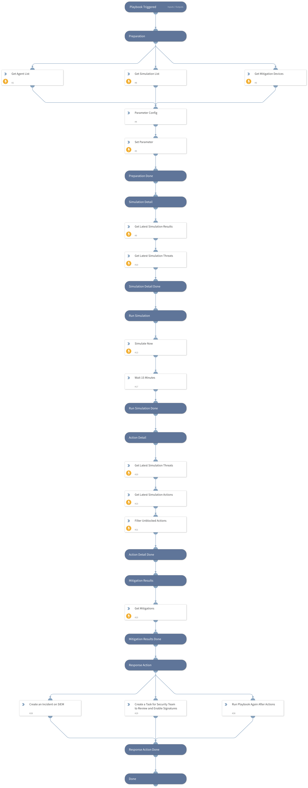

Picus NG Simulation Validation Automation

## Dependencies
This playbook uses the following sub-playbooks, integrations, and scripts.

### Sub-playbooks
This playbook does not use any sub-playbooks.

### Integrations
* PicusNG

### Scripts
This playbook does not use any scripts.

### Commands
* picus-simulate-now
* picus-get-latest-simulation-result
* picus-filter-insecure-attacks
* picus-get-signature-list
* picus-set-paramPB
* picus-get-simulation-actions
* picus-get-simulation-list
* picus-get-mitigation-devices
* picus-get-agent-list
* picus-get-simulation-threats

## Playbook Inputs
---
There are no inputs for this playbook.

## Playbook Outputs
---
There are no outputs for this playbook.

## Playbook Image
---
