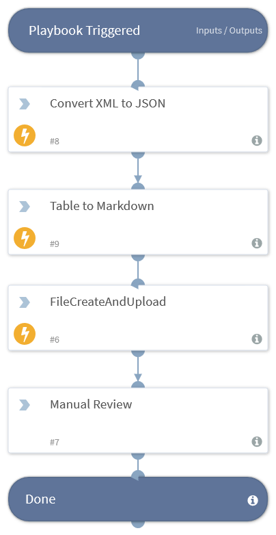

This playbook runs when a new report is sent from PingCastle. It then parses it to json and renders a table. It also puts a download link to the xml report in the war room.

## Dependencies
This playbook uses the following sub-playbooks, integrations, and scripts.

### Sub-playbooks
This playbook does not use any sub-playbooks.

### Integrations
This playbook does not use any integrations.

### Scripts
This playbook does not use any scripts.

### Commands
This playbook does not use any commands.

## Playbook Inputs
---

| **Name** | **Description** | **Default Value** | **Required** |
| --- | --- | --- | --- |
| Indicator Query | playbookInputQuery | type:File | Optional |

## Playbook Outputs
---
There are no outputs for this playbook.

## Playbook Image
---

