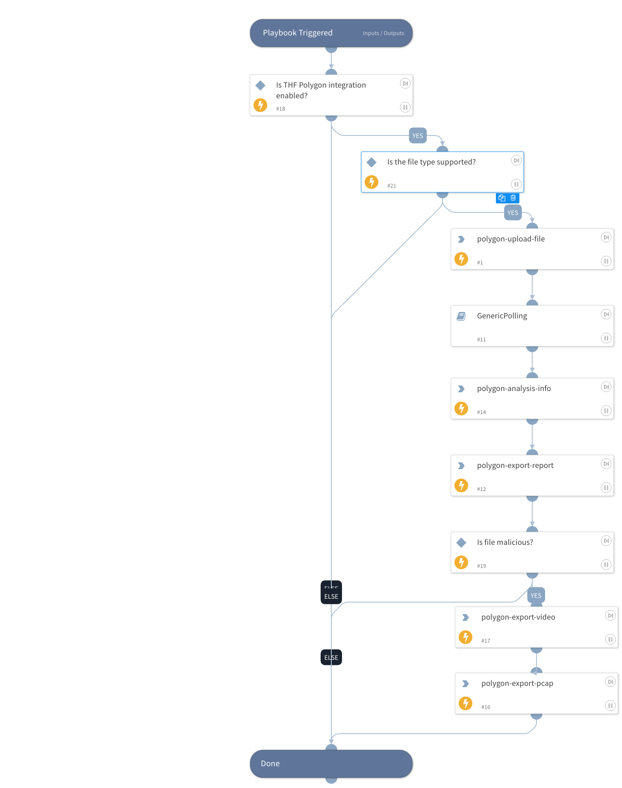

Detonate file using Group-IB THF Polygon integration. This playbook returns relevant reports to the War Room and file reputations to the context data. The detonation supports the following file types: 7z, ace, ar, arj, bat, bz2, cab, chm, cmd, com, cpgz, cpl, csv, dat, doc, docm, docx, dot, dotm, dotx, eml, exe, gz, gzip, hta, htm, html, iqy, iso, jar, js, jse, lnk, lz, lzma, lzo,  lzh, mcl, mht, msg, msi, msp, odp, ods, odt, ots, ott, pdf, pif, potm, potx, pps, ppsm, ppsx, ppt, pptm, pptx, ps1, pub, py, pyc, r*, rar, reg, rtf, scr, settingcontent-ms, stc, svg, sxc, sxw, tar, taz,  .tb2, .tbz, .tbz2, tgz, tlz, txz, tzo, txt, url, uue, vbe, vbs, wsf, xar, xls, xlsb, xlsm, xlsx, xml, xz, z*, zip.

## Dependencies

This playbook uses the following sub-playbooks, integrations, and scripts.

### Sub-playbooks

* GenericPolling

### Integrations

* Group-IB TDS Polygon

### Scripts

* Exists
* IsTrue

### Commands

* polygon-export-video
* polygon-analysis-info
* polygon-upload-file
* polygon-export-report
* polygon-export-pcap

## Playbook Inputs

---

| **Name** | **Description** | **Default Value** | **Required** |
| --- | --- | --- | --- |
| file_id | File EntryID to detonate | File.EntryID | Optional |
| Interval | Report requests frequency \(minutes\). | 1 | Required |
| Timeout | Report waiting timeout \(minutes\). | 60 | Required |
| Password | Password for the uploaded file. |  | Optional |

## Playbook Outputs

---

| **Path** | **Description** | **Type** |
| --- | --- | --- |
| File.Name | The full file name \(including file extension\). | string |
| File.MD5 | The MD5 hash of the file. | string |
| File.SHA1 | The SHA1 hash of the file. | string |
| File.SHA256 | The SHA256 hash of the file. | string |
| File.Type | File type. | string |
| File.Malicious.Vendor | The vendor that reported the file as malicious. | string |
| File.Malicious.Description | A description explaining why the file was determined to be malicious. | string |
| DBotScore.Indicator | The indicator that was tested. | string |
| DBotScore.Type | The indicator type. | string |
| DBotScore.Vendor | The vendor used to calculate the score. | string |
| DBotScore.Score | The actual score. | number |
| IP.Address | IP address. | string |
| Domain.Name | The domain name. | string |
| Domain.DNS | A list of IP objects resolved by DNS. | string |
| URL.Data | The URL. | string |
| RegistryKey.Path | The path to the registry key. | string |
| RegistryKey.Value | The value at the given RegistryKey. | string |
| Process.Name | Process name. | string |
| Process.PID | Process PID. | number |
| Process.CommandLine | Process command line. | string |
| Process.Path | Process path. | string |
| Process.StartTime | Process start time. | date |
| Process.EndTime | Process end time. | date |
| Polygon.Analysis.ID | Analysis ID in THF. | number |
| Polygon.Analysis.Name | File name. | string |
| Polygon.Analysis.Size | File size. | number |
| Polygon.Analysis.Started | Analysis start timestamp. | date |
| Polygon.Analysis.Analyzed | Analysis finish timestamp. | date |
| Polygon.Analysis.MD5 | Analyzed file MD5 hash. | string |
| Polygon.Analysis.SHA1 | Analyzed file SHA1 hash. | string |
| Polygon.Analysis.SHA256 | Analyzed file SHA256. | string |
| Polygon.Analysis.Result | Analysis verdict. | string |
| Polygon.Analysis.Status | The analysis status. | string |
| Polygon.Analysis.Verdict | Analysis verdict. | boolean |
| Polygon.Analysis.Probability | Verdict probability. | string |
| Polygon.Analysis.Families | Malware families. | string |
| Polygon.Analysis.Score | Polygon score. | number |
| Polygon.Analysis.Internet-connection | Internet availability. | string |
| Polygon.Analysis.Type | File type. | string |
| Polygon.Analysis.DumpExists | Network activity dump exists. | boolean |
| Polygon.Analysis.File | The information about files in analysis. | unknown |
| Polygon.Analysis.URL | The information about URL indicators. | unknown |
| Polygon.Analysis.IP | The information about IP indicators. | unknown |
| Polygon.Analysis.Domain | The information about Domain indicators. | unknown |
| Polygon.Analysis.RegistryKey | The information about registry keys which were modified during the analysis. | unknown |
| Polygon.Analysis.Process | The information about processes started during the analysis. | unknown |

## Playbook Image

---

