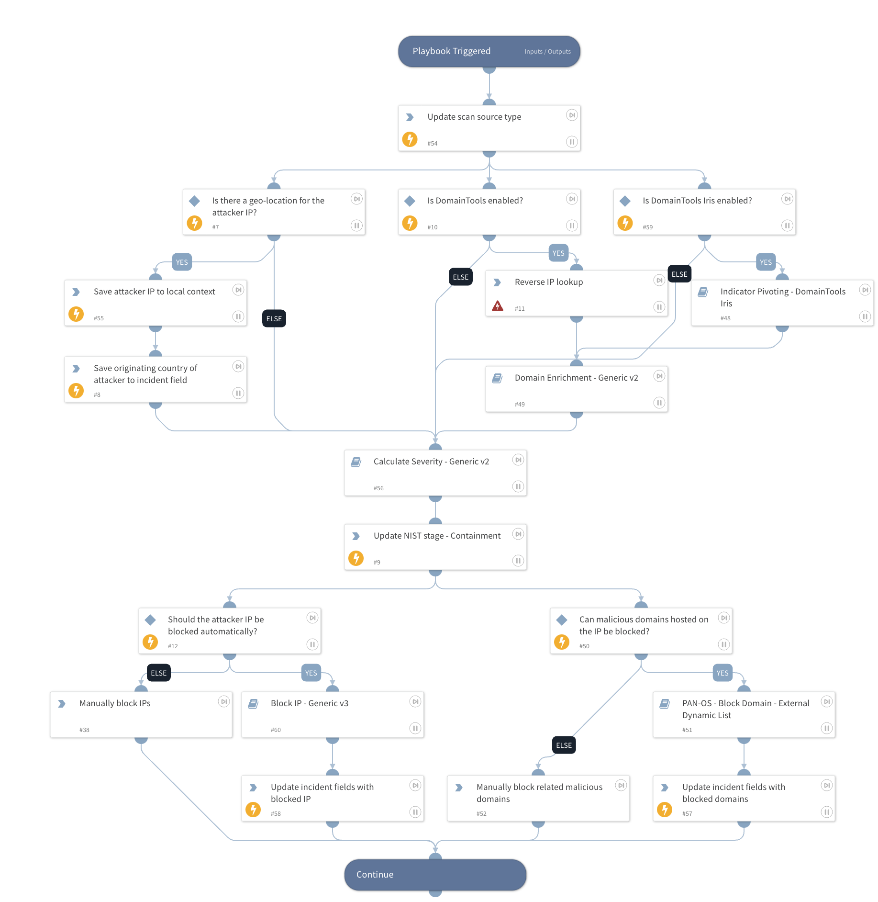

This playbook remediates port scans originating outside of the organization's network.

## Dependencies

This playbook uses the following sub-playbooks, integrations, and scripts.

### Sub-playbooks

* Block IP - Generic v3
* Indicator Pivoting - DomainTools Iris
* Calculate Severity - Generic v2
* Domain Enrichment - Generic v2

### Integrations

* DomainTools

### Scripts

* SetAndHandleEmpty

### Commands

* reverseIP
* setIncident

## Playbook Inputs

---

| **Name** | **Description** | **Default Value** | **Required** |
| --- | --- | --- | --- |
| BlockAttackerIP | Whether attacking IPs should be automatically blocked using firewalls. | False | Required |
| SourceExternalIPs | The external IP address\(es\) that initiated the port scan. |  | Optional |
| BlockMaliciousDomains | In the event that reverse IP lookup is performed, and a malicious domain is found, setting this to True will automatically block the malicious domains. If set to False, an analyst can manually block the domains. | False | Required |
| DBotScore | All the DBotScores that were calculated, either automatically by auto-reputation or using specific tasks, when the incident was ingested. This is used to calculate the incident severity at a later stage. | DBotScore | Optional |

## Playbook Outputs

---
There are no outputs for this playbook.

## Playbook Image

---

