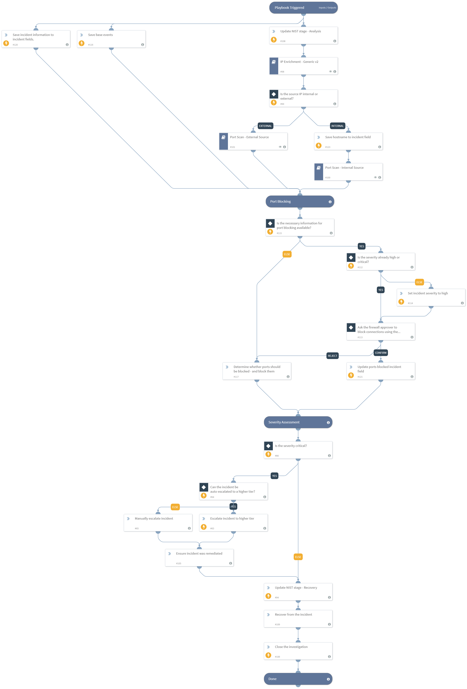

Investigates a port scan incident. The incident may originate from outside or within the network. The playbook:
- Enriches the hostname and IP address of the attacking endpoint
- Escalates the incident in case a critical asset is involved
- Hunts malware associated with the alerts across the organization
- Blocks detected malware associated with the incident
- Blocks IP addresses associated with the malware, if a malicious file was involved
- Pivots from the attacking IP to detect and block malicious domains hosted on the IP (for external scan)
- Isolates the attacking endpoint (for internal scan)
- Allows manual blocking of ports through an email communication task

If you're using one or more of the following products, make sure to configure their corresponding playbook inputs, respectively:
Splunk - "Splunk Indicator Hunting"
QRadar - "QRadar Indicator Hunting v2"
Palo Alto Networks Cortex Data Lake/Panorma/Autofocus/Analytics - "PANW - Hunting and threat detection by indicator type V2"

## Dependencies

This playbook uses the following sub-playbooks, integrations, and scripts.

### Sub-playbooks

* IP Enrichment - Generic v2
* Port Scan - Internal Source
* Port Scan - External Source

### Integrations

This playbook does not use any integrations.

### Scripts

* SetAndHandleEmpty
* AssignAnalystToIncident

### Commands

* setIncident
* closeInvestigation

## Playbook Inputs

---

| **Name** | **Description** | **Default Value** | **Required** |
| --- | --- | --- | --- |
| BlockAttackerIP | Whether attacking IPs should be automatically blocked using firewalls. | False | Required |
| WhitelistedHostnames | A list of hostnames that should not be isolated even if used in an attack. |  | Optional |
| IsolateEndpointIfCriticalIncident | Whether to automatically isolate endpoints if the incident severity is critical and the endpoint is not on the WhitelistedHostnames input, or opt for manual user approval. True means isolation will be done automatically when the conditions are met. | False | Required |
| InternalIPRanges | A list of IP ranges to check the IP against. The comma-separated list should be provided in CIDR notation. For example, a list of ranges would be: "172.16.0.0/12,10.0.0.0/8,192.168.0.0/16" \(without quotes\). | lists.PrivateIPs | Optional |
| RoleForEscalation | The name of the Cortex XSOAR role of the users that the incident can be escalated to in case the severity is determined to be critical. |  | Optional |
| BlockMaliciousFiles | Whether to automatically block malicious files involved with the incident across all endpoints in the organization. | False | Required |
| SourceIPs | The source IP address\(es\) that performed the port scan. If the source is an external IP, this input is mandatory for a proper incident response. If the source is an internal IP, then either this or the SourceHostnames input must be filled. The value must be unique. |  | Optional |
| SourceHostnames | The source hostname\(s\) that performed the port scan. If the source is an external IP, this input can remain empty. If the source was internal, then either this or the SourceIPs input must be filled. The value must be unique. |  | Optional |
| SourceUsernames | The Active Directory username\(s\) that were used in the port scan attack. |  | Optional |
| InvolvedFileMD5 | MD5 hashes of files that were involved in the port scan incident. |  | Optional |
| InvolvedFileSHA1 | SHA1 hashes of files that were involved in the port scan incident. |  | Optional |
| InvolvedFileSHA256 | SHA256 hashes of files that were involved in the port scan incident. |  | Optional |
| Event | The base events that contain the actual data from the port scan requests. The events should be a list of dictionaries that contain the action taken by the firewall \(Event.Action which could be Allowed for example\), the source IP \(Events.SourceIP\), destination IP \(Event.DestinationIP\) and destination port \(Event.DestinationPort\). The events are necessary to be able to block the necessary ports. |  | Optional |
| FirewallApproverEmail | The email address of the person that will be contacted if blocking certain ports is necessary. That person is expected to reply once they create the necessary firewall rule/s. |  | Optional |
| DestinationIPs | The destination IP addresses that were scanned. The value must be unique. |  | Optional |
| DestinationPorts | All the destination ports that were scanned \(non-unique\). |  | Optional |
| InvolvedFileName | Names of files that were involved in the port scan incident. |  | Optional |

## Playbook Outputs

---
There are no outputs for this playbook.

## Playbook Image

---

