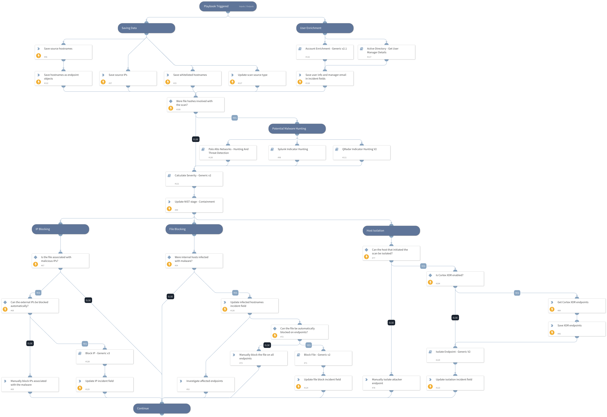

Remediates port scans originating within the network.

## Dependencies

This playbook uses the following sub-playbooks, integrations, and scripts.

### Sub-playbooks

* PANW - Hunting and threat detection by indicator type V2
* Account Enrichment - Generic v2.1
* Active Directory - Get User Manager Details
* Calculate Severity - Generic v2
* Block IP - Generic v3
* Splunk Indicator Hunting
* Block File - Generic v2
* QRadar Indicator Hunting V2
* Isolate Endpoint - Generic V2

### Integrations

This playbook does not use any integrations.

### Scripts

* SetAndHandleEmpty

### Commands

* xdr-get-endpoints
* setIncident

## Playbook Inputs

---

| **Name** | **Description** | **Default Value** | **Required** |
| --- | --- | --- | --- |
| BlockAttackerIP | Whether attacking IPs should be automatically blocked using firewalls. | False | Required |
| WhitelistedHostnames | A list of hostnames that should not be isolated even if used in an attack. |  | Optional |
| IsolateEndpointIfCriticalIncident | Whether to automatically isolate endpoints if the severity is critical and the endpoint is not on the WhitelistedHostnames input, or opt for manual user approval. True means isolation will be done automatically if the conditions are met. | False | Required |
| RoleForEscalation | The name of the Cortex XSOAR role of the users that the incident can be escalated to, in case of developments like lateral movement. |  | Optional |
| BlockMaliciousFiles | Whether to automatically block malicious files involved with the incident across all endpoints in the organization. | False | Required |
| InternalSourceIPs | The internal IP address\(es\) that performed the port scan. In order to properly respond to internal scans, either this or the SourceHostnames input has to be filled with data. |  | Optional |
| SourceHostnames | The source hostname\(s\) that performed the port scan. In order to properly respond to internal scans, either this or the InternalSourceIPs input has to be filled with data. |  | Optional |
| SourceUsernames | The Active Directory username\(s\) that were used in the port scan attack. |  | Optional |
| InvolvedFileMD5 | MD5 hashes of files that were involved in the port scan incident. |  | Optional |
| InvolvedFileSHA1 | SHA1 hashes of files that were involved in the port scan incident. |  | Optional |
| InvolvedFileSHA256 | SHA256 hashes of files that were involved in the port scan incident. |  | Optional |
| DBotScore | All the DBotScores that were calculated either automatically by auto-reputation, or using specific tasks, when the incident was ingested. This is used to calculate the incident severity at a later stage. | DBotScore | Optional |

## Playbook Outputs

---
There are no outputs for this playbook.

## Playbook Image

---

