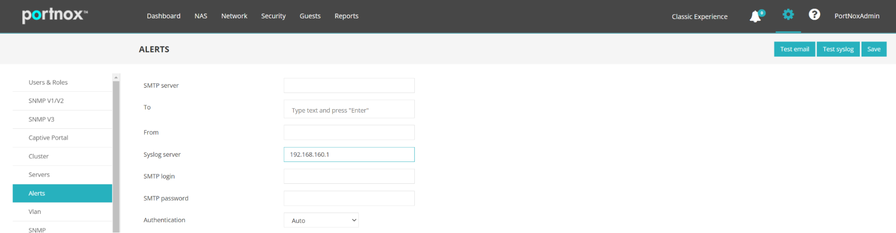
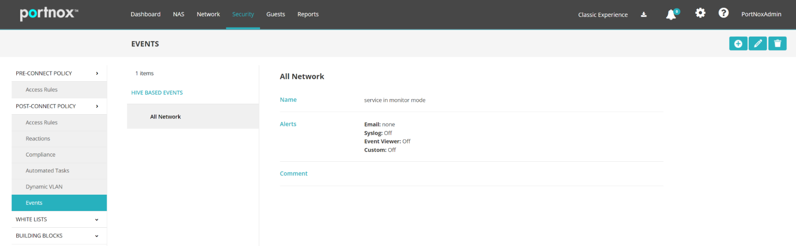
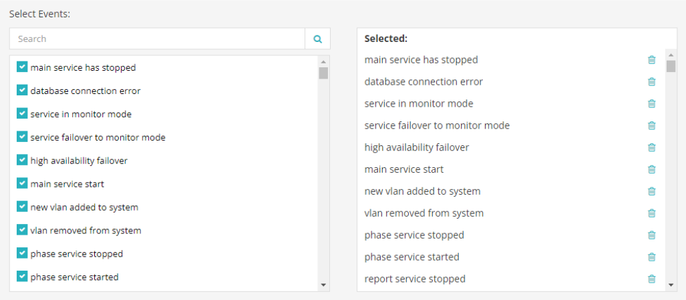
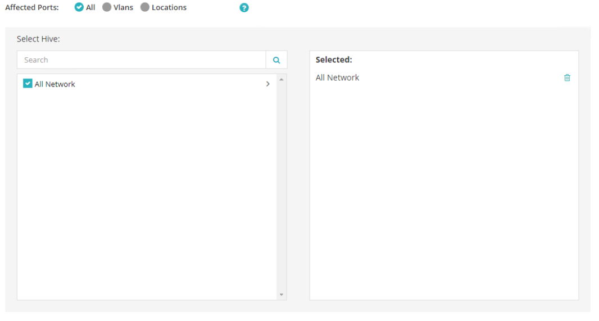
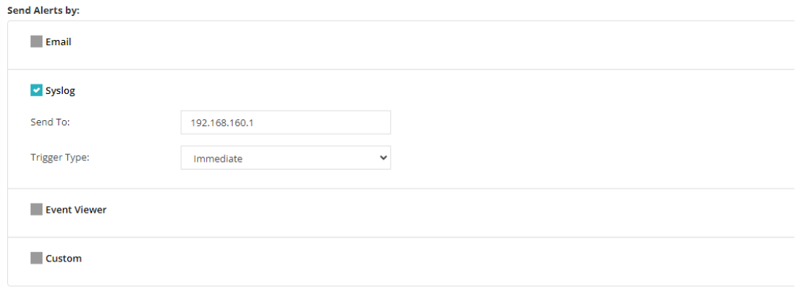

# Portnox
This pack includes Cortex XSIAM content.

## configuration on the server side
*On Portnox server run the following configurations.*

1. Go to **Settings** > **Alerts**.
2. In the **Syslog Server** field, add the IP address of the syslog server.

3. Click **Save**.
4. Go to **Security** -> **events**.
5. Click **+** on the top right corner.

6. Mark all events.

7. Make sure “All Network” is checked and “Send Alerts by” is configured to Syslog, using the IP address you want to send to and “Trigger Type” = “Immediate”.

8. Click **Save & Close** at the top right corner.

## Collect Events from Vendor
In order to use the collector, use the [Broker VM](#broker-vm) option.

### Broker VM
To create or configure the Broker VM, use the information described [here](https://docs-cortex.paloaltonetworks.com/r/Cortex-XDR/Cortex-XDR-Pro-Administrator-Guide/Configure-the-Broker-VM).

You can configure the specific vendor and product for this instance.

1. Navigate to **Settings** > **Configuration** > **Data Broker** > **Broker VMs**. 
2. Go to the apps tab and add the **Syslog** app. If it already exists, click the **Syslog** app and then click **Configure**.
3. Click **Add New**.
4. When configuring the Syslog Collector, change the format to CEF and set:
   - vendor as vendor - Portnox
   - product as product - Portnox

*NOTE:* The log format is CEF. The name of the Vender and the Product will be based on the vendor and product fields in the raw data.