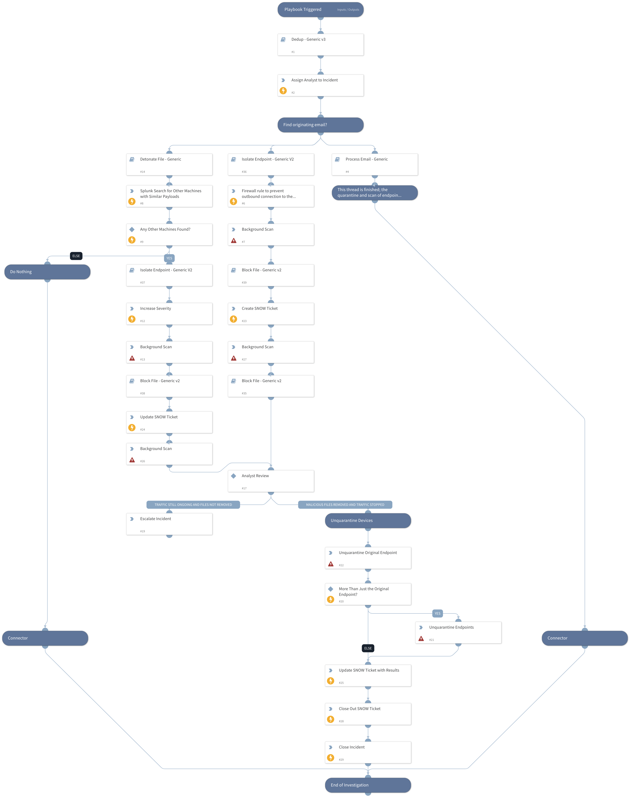

The Powershell Payload Response playbook is designed to be used when file payload executions are detected from an endpoint machines Powershell and begins the remediation process.

## Dependencies
This playbook uses the following sub-playbooks, integrations, and scripts.

### Sub-playbooks
* Process Email - Generic
* Isolate Endpoint - Generic V2
* Block File - Generic v2
* Dedup - Generic v3
* Detonate File - Generic

### Integrations
* Carbon Black Defense
* Carbon Black Enterprise EDR
* ServiceNow v2
* SplunkPy

### Scripts
* AssignAnalystToIncident
* IncreaseIncidentSeverity

### Commands
* cb-eedr-device-background-scan
* splunk-search
* closeInvestigation
* cbd-create-policy
* servicenow-update-ticket
* cb-eedr-device-unquarantine
* servicenow-create-ticket

## Playbook Inputs
---

| **Name** | **Description** | **Default Value** | **Required** |
| --- | --- | --- | --- |
| Endpoint ID | ID of the endpoint in question. | ${incident.endpointid} | Optional |
| Hostname | Hostname of the endpoint in question. | ${incident.hostname} | Optional |
| Email | Email attachment. | ${incident.email} | Optional |
| File | Payload file that was executed. | ${File} | Optional |
| File Path | File Path of the Executed Payload. | ${incident.filepath} | Optional |

## Playbook Outputs
---
There are no outputs for this playbook.

## Playbook Image
---
