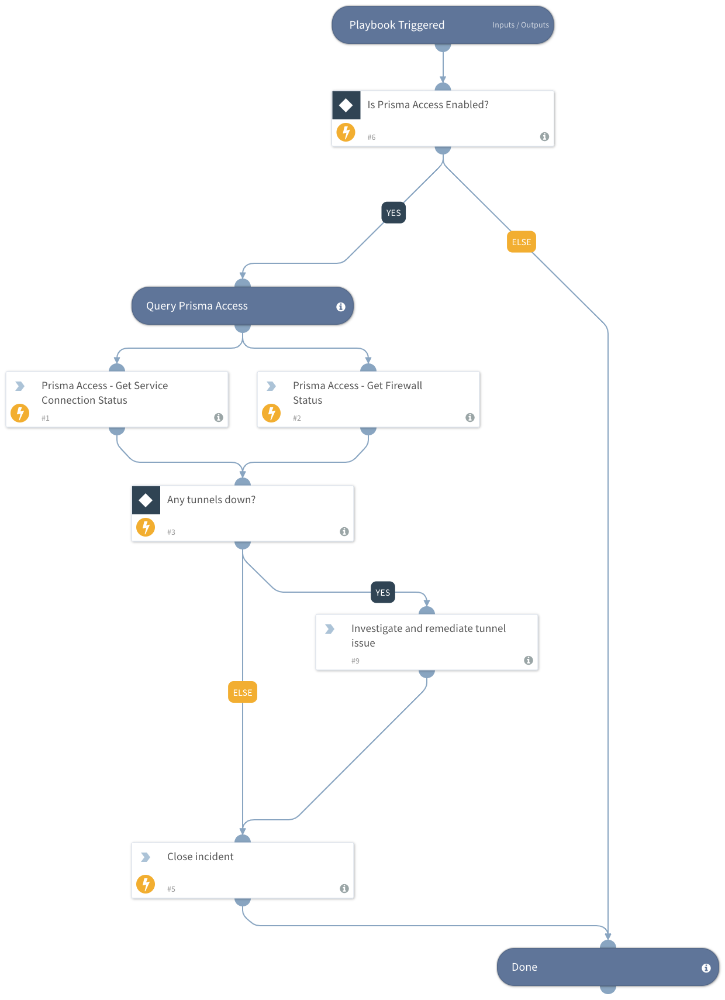

Use the Prisma Access integration to run SSH CLI commands and query the connection states for all tunnels. If any tunnels are down - the playbook escalates to a manual task for remediation and provides recommendations on next steps in the task description.

The playbook can be run as a job, or triggered from an incoming event to confirm an initial suspicion (such as a tunnel log from Cortex Data Lake) to validate that the issue still exists.

## Dependencies
This playbook uses the following sub-playbooks, integrations, and scripts.

### Sub-playbooks
This playbook does not use any sub-playbooks.

### Integrations
* PrismaAccess

### Scripts
This playbook does not use any scripts.

### Commands
* prisma-access-query
* closeInvestigation

## Playbook Inputs
---
There are no inputs for this playbook.

## Playbook Outputs
---
There are no outputs for this playbook.

## Playbook Image
---

