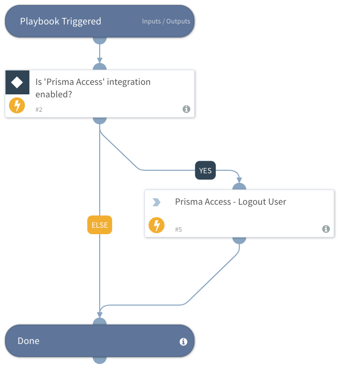

This playbook forces logout of a specific user and computer from Prisma Access.

## Dependencies
This playbook uses the following sub-playbooks, integrations, and scripts.

### Sub-playbooks
This playbook does not use any sub-playbooks.

### Integrations
* Prisma Access

### Scripts
This playbook does not use any scripts.

### Commands
* prisma-access-logout-user

## Playbook Inputs
---

| **Name** | **Description** | **Default Value** | **Source** | **Required** |
| --- | --- | --- | --- | --- |
| username | Username to log out  with Prisma Access |  |  | Required |
| domain | Domain name for the user |  |  | Required |
| hostname | Hostname of  the machine to log out |  |  | Required |

## Playbook Outputs
---
There are no outputs for this playbook.

