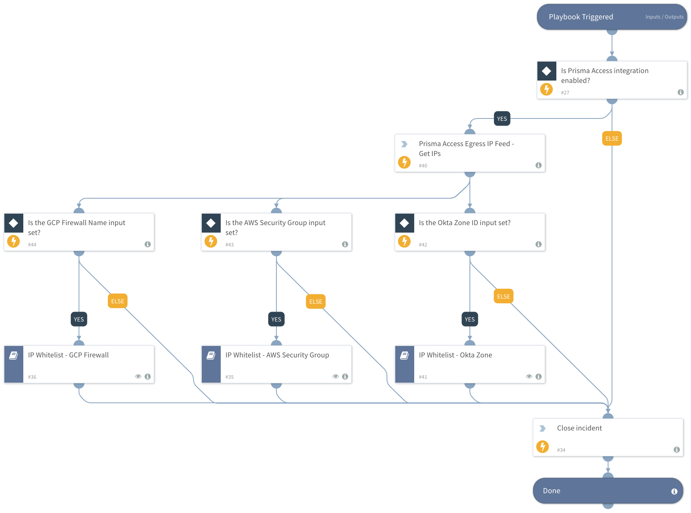

Retrieve Prisma Access Egress IP for specific geographic Zones and populate in security groups within cloud services.

## Dependencies
This playbook uses the following sub-playbooks, integrations, and scripts.

### Sub-playbooks
* IP Whitelist - AWS Security Group
* IP Whitelist - GCP Firewall
* Allow IP - Okta Zone

### Integrations
* PrismaAccessEgressIPFeed

### Scripts
This playbook does not use any scripts.

### Commands
* prisma-access-get-indicators
* closeInvestigation

## Playbook Inputs
---

| **Name** | **Description** | **Default Value** | **Required** |
| --- | --- | --- | --- |
| Indicator Query | Indicators matching the indicator query will be used as playbook input |  | Optional |
| AWSSecurityGroupName | Name of the AWS Security Group to update with the IPs. |  | Optional |
| GCPFirewallName |  |  | Optional |
| OktaZoneID | ID of the Okta Zone to update. Use \!okta\-list\-zones to obtain |  | Optional |

## Playbook Outputs
---
There are no outputs for this playbook.

## Playbook Image
---
