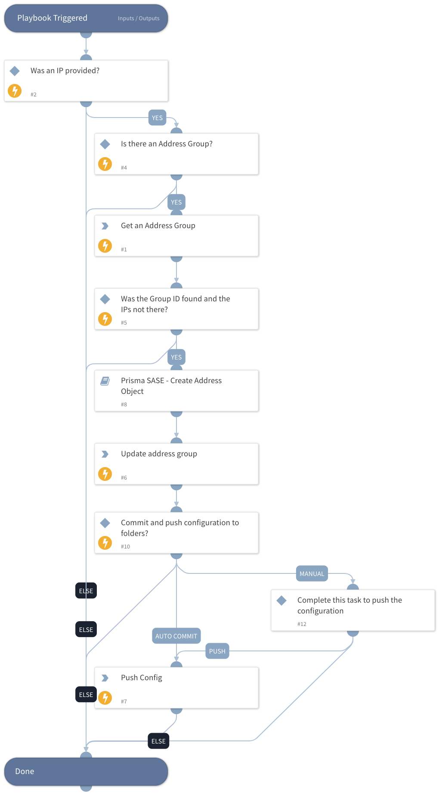

This playbook appends a Static Address Group with provided IPs. 

## Dependencies

This playbook uses the following sub-playbooks, integrations, and scripts.

### Sub-playbooks

Prisma SASE - Create Address Object

### Integrations

* PrismaSASE

### Scripts

This playbook does not use any scripts.

### Commands

* prisma-sase-address-group-list
* prisma-sase-address-group-update
* prisma-sase-candidate-config-push

## Playbook Inputs

---

| **Name** | **Description** | **Default Value** | **Required** |
| --- | --- | --- | --- |
| TSGID | Tenant services group ID. If not provided, the tsg_id integration parameter will be used as the default. |  | Optional |
| AutoCommit | Possible Values: True -&amp;gt; Will Commit and Push Configuration False -&amp;gt; Manual Push will be required. Else --&amp;gt; Will ignore the push section and continue the playbook. |  | Optional |
| IP | The IP address value,comma-separated form. |  | Optional |
| AddressGroupName | Possible Values: True -&amp;gt; Will Commit and Push Configuration False -&amp;gt; Manual Push will be required. Else --&amp;gt; Will ignore the push section and continue the playbook. |  | Optional |
| Folder | The configuration folder group setting. The default value is 'Shared' | Shared | Optional |

## Playbook Outputs

---
There are no outputs for this playbook.

## Playbook Image

---

