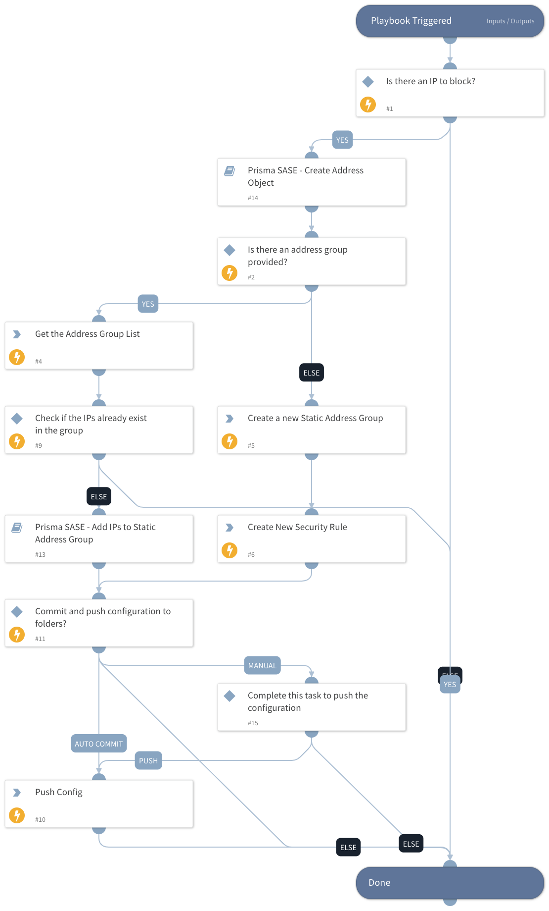

This playbook assists in blocking communication with the provided IPs in the Prisma SASE policy.
If a group name is provided, the IPs will be added to the mentioned static address group (there should be a rule associated with the group name to block communication with that group).
And if the group name is not provided, a new group will be created with a dedicated rule to block communication with those IPs.

## Dependencies

This playbook uses the following sub-playbooks, integrations, and scripts.

### Sub-playbooks

* Prisma SASE - Create Address Object
* Prisma SASE - Add IPs to Static Address Group

### Integrations

* PrismaSASE

### Scripts

This playbook does not use any scripts.

### Commands

* prisma-sase-candidate-config-push
* prisma-sase-security-rule-create
* prisma-sase-address-group-list
* prisma-sase-address-group-create

## Playbook Inputs

---

| **Name** | **Description** | **Default Value** | **Required** |
| --- | --- | --- | --- |
| TSGID | Tenant services group ID. If not provided, the tsg_id integration parameter will be used as the default. |  | Optional |
| IP | The address value \(should match the type\). |  | Optional |
| Folder | The configuration folder group setting. The default value is 'Shared'. | Shared | Optional |
| StaticAddressGroupName | The static address group name will be appended with IP indicators. |  | Optional |
| AutoCommit | Possible Values: True -&amp;gt; Will commit and push configuration. False -&amp;gt; Manual push will be required. Else --&amp;gt; Will ignore the push section and continue the playbook. |  | Optional |

## Playbook Outputs

---

| **Path** | **Description** | **Type** |
| --- | --- | --- |
| PrismaSase.AddressGroup | The Prisma Access Address group object. | unknown |
| PrismaSase.AddressGroup.id | The address group ID. | unknown |
| PrismaSase.AddressGroup.name | The address group name. | unknown |
| PrismaSase.AddressGroup.description | The address group description. | unknown |
| PrismaSase.AddressGroup.addresses | The address group addresses. | unknown |
| PrismaSase.AddressGroup.dynamic_filter | The address group filter. | unknown |
| PrismaSase.AddressGroup.folder | The address group folder. | unknown |
| PrismaSase | The root context key for Prisma SASE integration output. | unknown |
| PrismaSase.SecurityRule | Created security rule. | unknown |
| PrismaSase.SecurityRule.action | Security rule action. | unknown |
| PrismaSase.SecurityRule.application | Security rule application. | unknown |
| PrismaSase.SecurityRule.category | Security rule category. | unknown |
| PrismaSase.SecurityRule.description | Security rule description. | unknown |
| PrismaSase.SecurityRule.destination | Security rule destination. | unknown |
| PrismaSase.SecurityRule.folder | Security rule folder. | unknown |
| PrismaSase.SecurityRule.from | Security rule from field \(source zone\(s\)\). | unknown |
| PrismaSase.SecurityRule.id | Security rule ID. | unknown |
| PrismaSase.SecurityRule.name | Security rule name. | unknown |
| PrismaSase.SecurityRule.position | Security rule position. | unknown |
| PrismaSase.SecurityRule.service | Security rule service. | unknown |
| PrismaSase.SecurityRule.source | Security rule source. | unknown |
| PrismaSase.SecurityRule.source_user | Security rule source user. | unknown |
| PrismaSase.SecurityRule.to | Security rule to field \(destination zone\(s\)\). | unknown |
| PrismaSase.SecurityRule.profile_setting | The Security rule group object in the rule. | unknown |
| PrismaSase.SecurityRule.profile_setting.group | Security rule group. | unknown |
| PrismaSase.CandidateConfig | Configuration job object. | unknown |
| PrismaSase.CandidateConfig.job_id | Configuration job ID. | unknown |
| PrismaSase.CandidateConfig.result | The configuration push result, e.g., OK, FAIL. | unknown |
| PrismaSase.CandidateConfig.details | The configuration push details. | unknown |
| PrismaSase.Address | Created address object. | unknown |
| PrismaSase.Address.description | Address description. | unknown |
| PrismaSase.Address.folder | Address folder. | unknown |
| PrismaSase.Address.id | Address ID. | unknown |
| PrismaSase.Address.type | Address type. | unknown |
| PrismaSase.Address.address_value | Address value. | unknown |
| PrismaSase.Address.name | Address name. | unknown |

## Playbook Image

---

