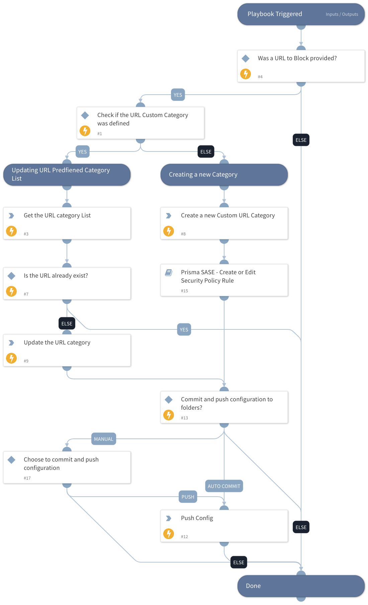

The playbook will handle the operation of blocking a URL within the organization.
If a category is provided, the URL will be added to the list.
If not, a new URL category will be created, and a new security rule that blocks that category.

## Dependencies

This playbook uses the following sub-playbooks, integrations, and scripts.

### Sub-playbooks

* Prisma SASE - Create or Edit Security Policy Rule

### Integrations

* PrismaSASE

### Scripts

This playbook does not use any scripts.

### Commands

* prisma-sase-custom-url-category-create
* prisma-sase-custom-url-category-list
* prisma-sase-candidate-config-push
* prisma-sase-custom-url-category-update

## Playbook Inputs

---

| **Name** | **Description** | **Default Value** | **Required** |
| --- | --- | --- | --- |
| URL | List of URLs that are needed to be blocked. |  | Optional |
| CategoryName | The name of the predefined custom URL category. |  | Optional |
| Folder | Specify the scope for a newly created security rule to be applied. Remember, this input will only be used when there is no input to the CategoryName. Default: Shared | Shared | Optional |
| TSGID | Tenant services group ID. If not provided, the tsg_id integration parameter will be used as the default. |  | Optional |
| AutoCommit | Possible Values: True -&amp;gt; Will Commit and Push Configuration False -&amp;gt; Manual Push will be required. Else --&amp;gt; Will ignore the push section and continue the playbook. |  | Optional |

## Playbook Outputs

---

| **Path** | **Description** | **Type** |
| --- | --- | --- |
| PrismaSase | The root context key for Prisma SASE integration output. | unknown |
| PrismaSase.SecurityRule | Created security rule. | unknown |
| PrismaSase.SecurityRule.action | Security rule action. | unknown |
| PrismaSase.SecurityRule.application | Security rule application. | unknown |
| PrismaSase.SecurityRule.category | Security rule category. | unknown |
| PrismaSase.SecurityRule.description | Security rule description. | unknown |
| PrismaSase.SecurityRule.destination | Security rule destination. | unknown |
| PrismaSase.SecurityRule.folder | Security rule folder. | unknown |
| PrismaSase.SecurityRule.from | Security rule from field \(source zone\(s\)\). | unknown |
| PrismaSase.SecurityRule.id | Security rule ID. | unknown |
| PrismaSase.SecurityRule.name | Security rule name. | unknown |
| PrismaSase.SecurityRule.position | Security rule position. | unknown |
| PrismaSase.SecurityRule.service | Security rule service. | unknown |
| PrismaSase.SecurityRule.source | Security rule source. | unknown |
| PrismaSase.SecurityRule.source_user | Security rule source user. | unknown |
| PrismaSase.SecurityRule.to | Security rule to field \(destination zone\(s\)\). | unknown |
| PrismaSase.SecurityRule.profile_setting | The Security rule group object in the rule. | unknown |
| PrismaSase.SecurityRule.profile_setting.group | Security rule group. | unknown |
| PrismaSase.CandidateConfig | Configuration job object. | unknown |
| PrismaSase.CandidateConfig.job_id | Configuration job ID. | unknown |
| PrismaSase.CandidateConfig.result | The configuration push result, e.g. OK, FAIL. | unknown |
| PrismaSase.CandidateConfig.details | The configuration push details. | unknown |
| PrismaSase.CustomURLCategory | The custom URL category object. | unknown |
| PrismaSase.CustomURLCategory.id | The URL category ID. | unknown |
| PrismaSase.CustomURLCategory.name | The URL category name. | unknown |
| PrismaSase.CustomURLCategory.folder | The URL category folder. | unknown |
| PrismaSase.CustomURLCategory.type | The URL category type. | unknown |
| PrismaSase.CustomURLCategory.list | The URL category match list. | unknown |
| PrismaSase.CustomURLCategory.description | The URL category description. | unknown |

## Playbook Image

---

