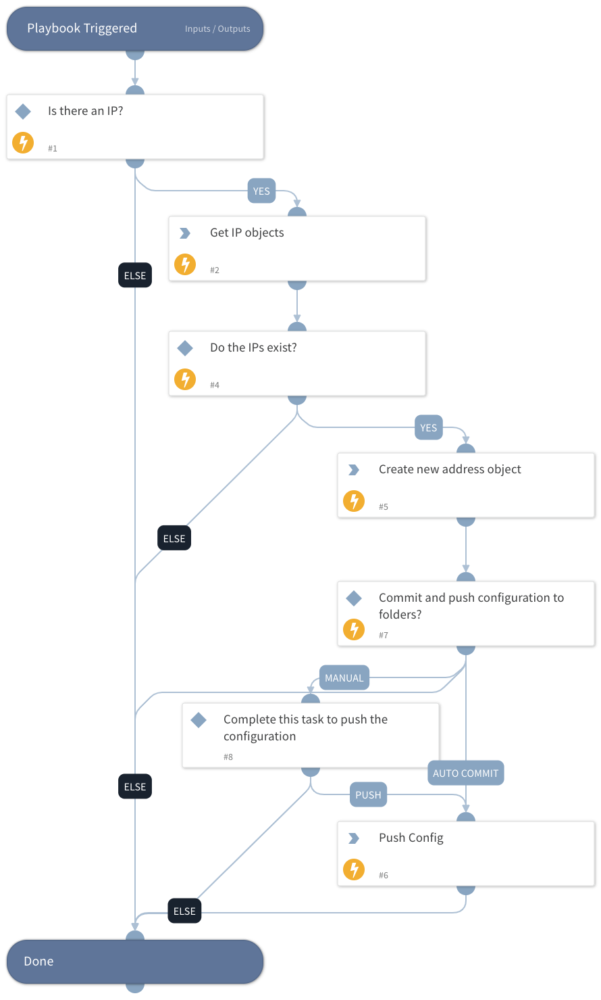

This playbook creates new address objects in the Prisma SASE Object section. Those objects can be used later on in other objects such as Security Rules.

## Dependencies

This playbook uses the following sub-playbooks, integrations, and scripts.

### Sub-playbooks

This playbook does not use any sub-playbooks.

### Integrations

* PrismaSASE

### Scripts

This playbook does not use any scripts.

### Commands

* prisma-sase-candidate-config-push
* prisma-sase-address-object-list
* prisma-sase-address-object-create

## Playbook Inputs

---

| **Name** | **Description** | **Default Value** | **Required** |
| --- | --- | --- | --- |
| IP | The address value \(should match the type\) |  | Optional |
| TSGID | Tenant services group ID. If not provided, the tsg_id integration parameter will be used as the default. |  | Optional |
| Folder | The configuration folder group setting. The default value is 'Shared'. | Shared | Optional |
| AutoCommit | Possible values: True -&amp;gt; Will commit and push configuration. False -&amp;gt; Manual push will be required. Else --&amp;gt; Will ignore the push section and continue the playbook. |  | Optional |
| Type | IP Netmask: IP address or a network using the slash notation - ip_address/mask. IP Range: Range of IP addresses using the notation ip_address-ip_address. IP Wildcard: IP wildcard address in the format of an IPv4 address followed by a slash and a mask. FQDN: Domain name. |  | Optional |
| limit | Default: 50  This input controls the limit size for the get IP objects command. This will help to avoid object duplicates in the systems.  | 50 | Optional |

## Playbook Outputs

---

| **Path** | **Description** | **Type** |
| --- | --- | --- |
| PrismaSase | The root context key for Prisma SASE integration output. | unknown |
| PrismaSase.Address | Created address object. | unknown |
| PrismaSase.Address.description | Address description. | unknown |
| PrismaSase.Address.folder | Address folder. | unknown |
| PrismaSase.Address.id | Address ID. | unknown |
| PrismaSase.Address.type | Address type. | unknown |
| PrismaSase.Address.address_value | Address value. | unknown |
| PrismaSase.Address.name | Address name. | unknown |

## Playbook Image

---

