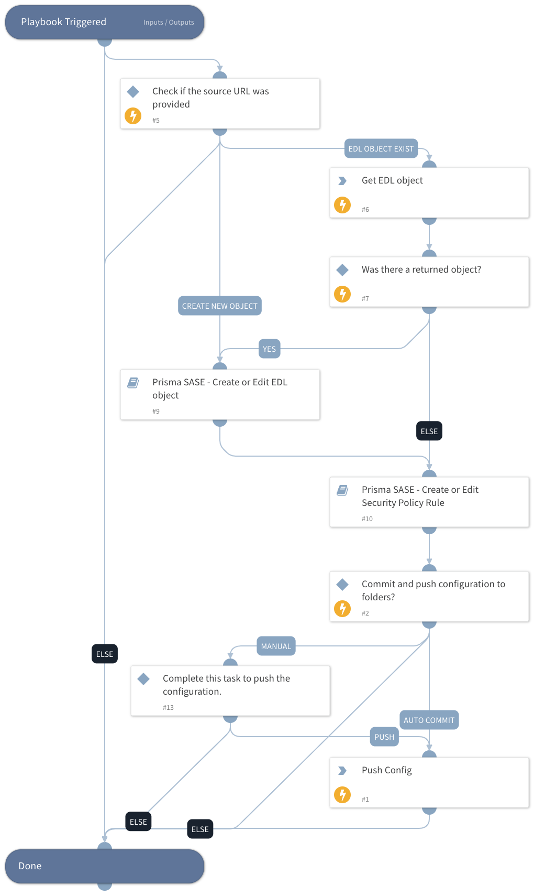

This playbook helps to create a security rule to block indicators from an EDL. This playbook should run only once to setup the EDL object and its rule.

## Dependencies

This playbook uses the following sub-playbooks, integrations, and scripts.

### Sub-playbooks

* Prisma SASE - Create or Edit EDL object
* Prisma SASE - Create or Edit Security Policy Rule

### Integrations

* PrismaSASE

### Scripts

This playbook does not use any scripts.

### Commands

* prisma-sase-external-dynamic-list-list
* prisma-sase-candidate-config-push

## Playbook Inputs

---

| **Name** | **Description** | **Default Value** | **Required** |
| --- | --- | --- | --- |
| TSGID | Tenant services group ID. If not provided, the tsg_id integration parameter will be used as the default. |  | Optional |
| Folder | The configuration folder group setting. The default value is 'Shared'. | Shared | Optional |
| URL | The source URL. If the type is ip, url or domain, a value must be provided. |  | Optional |
| EDLObjectName | The external dynamic list object name. |  | Optional |
| RuleName | The Security Policy Rule name will be created for blocking the indicators. | Block Indicators using EDL - XSOAR incident #${incident.id} | Optional |
| EDLObjectType | Possible values: domain,ip,url,predefined_ip,predefined_url |  | Optional |
| AutoCommit | Possible Values: True -&amp;gt; Will commit and push configuration. False -&amp;gt; Manual push will be required. Else --&amp;gt; Will ignore the push section and continue the playbook. |  | Optional |

## Playbook Outputs

---

| **Path** | **Description** | **Type** |
| --- | --- | --- |
| PrismaSase.CandidateConfig | Configuration job object. | unknown |
| PrismaSase.CandidateConfig.job_id | Configuration job ID. | unknown |
| PrismaSase.CandidateConfig.result | The configuration push result, e.g. OK, FAIL. | unknown |
| PrismaSase.CandidateConfig.details | The configuration push details. | unknown |
| PrismaSase.ExternalDynamicList | The external dynamic list object. | unknown |
| PrismaSase.ExternalDynamicList.id | The external dynamic list ID. | unknown |
| PrismaSase.ExternalDynamicList.name | The external dynamic list name. | unknown |
| PrismaSase.ExternalDynamicList.folder | The external dynamic list folder. | unknown |
| PrismaSase.ExternalDynamicList.description | The external dynamic list description. | unknown |
| PrismaSase.ExternalDynamicList.type | The external dynamic list type. | unknown |
| PrismaSase.ExternalDynamicList.source | The external dynamic list source. | unknown |
| PrismaSase.ExternalDynamicList.frequency | The external dynamic list frequency. | unknown |
| PrismaSase | The root context key for Prisma SASE integration output. | unknown |
| PrismaSase.SecurityRule | Found security rule. | unknown |
| PrismaSase.SecurityRule.action | Security rule action. | unknown |
| PrismaSase.SecurityRule.application | Security rule application. | unknown |
| PrismaSase.SecurityRule.category | Security rule category. | unknown |
| PrismaSase.SecurityRule.description | Security rule description. | unknown |
| PrismaSase.SecurityRule.destination | Security rule destination. | unknown |
| PrismaSase.SecurityRule.folder | Security rule folder. | unknown |
| PrismaSase.SecurityRule.from | Security rule from field \(source zone\(s\)\). | unknown |
| PrismaSase.SecurityRule.id | Security rule ID. | unknown |
| PrismaSase.SecurityRule.log_setting | Security rule log setting. | unknown |
| PrismaSase.SecurityRule.name | Security rule name. | unknown |
| PrismaSase.SecurityRule.position | Security rule position. | unknown |
| PrismaSase.SecurityRule.service | Security rule service. | unknown |
| PrismaSase.SecurityRule.source | Security rule source. | unknown |
| PrismaSase.SecurityRule.source_user | Security rule source user. | unknown |
| PrismaSase.SecurityRule.to | Security rule to field \(destination zone\(s\)\). | unknown |
| PrismaSase.SecurityRule.negate_destination | Security rule negate destination. | unknown |
| PrismaSase.SecurityRule.profile_setting | The Security rule group object in the rule. | unknown |
| PrismaSase.SecurityRule.profile_setting.group | Security rule group. | unknown |

## Playbook Image

---

