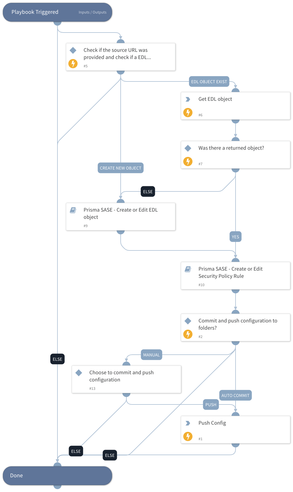

This playbook helps to create a security rule to block indicators from an EDL. This playbook should run only once to setup the EDL object and its rule.

## Dependencies

This playbook uses the following sub-playbooks, integrations, and scripts.

### Sub-playbooks

* Prisma SASE - Create EDL
* Prisma SASE - Create Security Policy Rule

### Integrations

* PrismaSASE

### Scripts

This playbook does not use any scripts.

### Commands

* prisma-sase-external-dynamic-list-list
* prisma-sase-candidate-config-push

## Playbook Inputs

---

| **Name** | **Description** | **Default Value** | **Required** |
| --- | --- | --- | --- |
| TSGID | Tenant services group ID. If not provided, the tsg_id integration parameter will be used as the default. |  | Optional |
| Folder | The configuration folder group setting. The default value is 'Shared' | Shared | Optional |
| URL | The source URL. If the type is ip, url or domain, a value must be provided. |  | Optional |
| EDLObjectName | The external dynamic list object name. |  | Optional |
| RuleName | The Security Policy Rule name will be created for blocking the indicators. | Block Indicators using EDL - XSOAR incident #${incident.id} | Optional |
| EDLObjectType | Possible values: domain,ip,url,predefined_ip,predefined_url |  | Optional |
| AutoCommit | Possible Values: True -&amp;gt; Will Commit and Push Configuration False -&amp;gt; Manual Push will be required. Else --&amp;gt; Will ignore the push section and continue the playbook. |  | Optional |

## Playbook Outputs

---
There are no outputs for this playbook.

## Playbook Image

---

