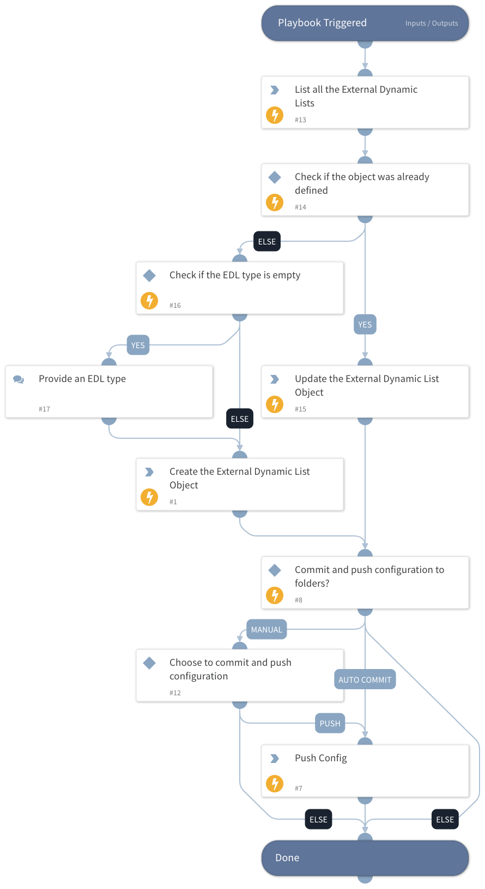

This playbook helps to create an EDL object within the Prisma SASE Objects section.

## Dependencies

This playbook uses the following sub-playbooks, integrations, and scripts.

### Sub-playbooks

This playbook does not use any sub-playbooks.

### Integrations

* PrismaSASE

### Scripts

This playbook does not use any scripts.

### Commands

* prisma-sase-external-dynamic-list-create
* prisma-sase-candidate-config-push
* prisma-sase-external-dynamic-list-update
* prisma-sase-external-dynamic-list-list

## Playbook Inputs

---

| **Name** | **Description** | **Default Value** | **Required** |
| --- | --- | --- | --- |
| Name | The external dynamic list object name. |  | Optional |
| Folder | The configuration folder group setting. The default value is 'Shared'. | Shared | Optional |
| TSGID | Tenant services group ID. If not provided, the tsg_id integration parameter will be used as the default. |  | Optional |
| IPListName | The predefined IP list. If the type is predefined_ip, a value must be provided. Possible values: panw-bulletproof-ip-list,panw-highrisk-ip-list,panw-known-ip-list,panw-torexit-ip-list. |  | Optional |
| URLListName | The predefined URL list. If the type is predefined_url, a value must be provided.  Possible value: panw–auth-portal-exclude-list |  | Optional |
| SourceURL | The source URL. If the type is ip, url or domain, a value must be provided. |  | Optional |
| Frequency | Frequency to check for updates on the EDL URL. Possible values: daily,five_minute,hourly,monthly,weekly |  | Optional |
| FrequencyTime | The frequency hour. If the frequency argument is daily, weekly or monthly, a value must be provided. Possible values are 00-23. |  | Optional |
| EDLObjectType | Possible values: domain,ip,url,predefined_ip,predefined_url |  | Optional |
| AutoCommit | Possible values: True -&amp;gt; Will commit and push configuration. False -&amp;gt; Manual push will be required. Else --&amp;gt; Will ignore the push section and continue the playbook. |  | Optional |
| Overwrite | Whether to overwrite the original external dynamic list values. Default value is 'false'. | False | Optional |

## Playbook Outputs

---

| **Path** | **Description** | **Type** |
| --- | --- | --- |
| PrismaSase.ExternalDynamicList | The external dynamic list object. | unknown |
| PrismaSase.ExternalDynamicList.id | The external dynamic list ID. | unknown |
| PrismaSase.ExternalDynamicList.name | The external dynamic list name. | unknown |
| PrismaSase.ExternalDynamicList.folder | The external dynamic list folder. | unknown |
| PrismaSase.ExternalDynamicList.description | The external dynamic list description. | unknown |
| PrismaSase.ExternalDynamicList.type | The external dynamic list type. | unknown |
| PrismaSase.ExternalDynamicList.source | The external dynamic list source. | unknown |
| PrismaSase.ExternalDynamicList.frequency | The external dynamic list frequency. | unknown |
| PrismaSase.CandidateConfig | Configuration job object. | unknown |
| PrismaSase.CandidateConfig.job_id | Configuration job ID. | unknown |
| PrismaSase.CandidateConfig.result | The configuration push result, e.g., OK, FAIL. | unknown |
| PrismaSase.CandidateConfig.details | The configuration push details. | unknown |

## Playbook Image

---

