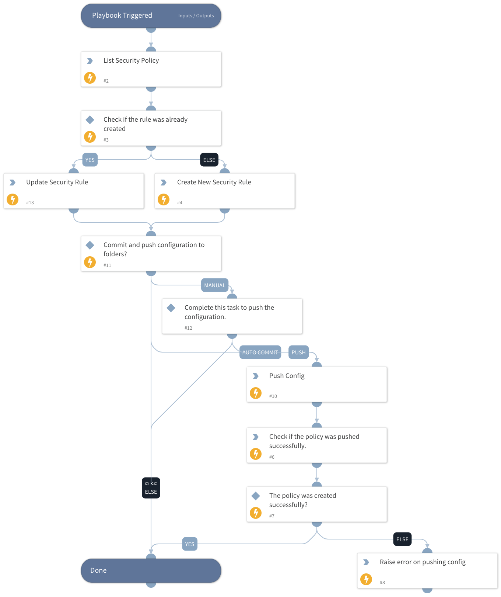

This playbook handles the creation or editing of the Security Policy Rule for Prisma SASE integration. 

## Dependencies

This playbook uses the following sub-playbooks, integrations, and scripts.

### Sub-playbooks

This playbook does not use any sub-playbooks.

### Integrations

* PrismaSASE

### Scripts

* PrintErrorEntry

### Commands

* prisma-sase-security-rule-update
* prisma-sase-security-rule-create
* prisma-sase-security-rule-list
* prisma-sase-candidate-config-push

## Playbook Inputs

---

| **Name** | **Description** | **Default Value** | **Required** |
| --- | --- | --- | --- |
| TSGID | Tenant services group ID. If not provided, the tsg_id integration parameter will be used as the default. |  | Optional |
| Folder | The configuration folder group setting. The default value is 'Shared'. | Shared | Optional |
| Action | Possible values: allow,deny,drop,reset-both,reset-client,reset-server. |  | Optional |
| Position | Rule position. The default value is 'pre'. | pre | Optional |
| Source | A comma-separated list of source networks. The default value is 'any'. | any | Optional |
| Destination | A comma-separated list of destination networks. The default value is 'any'. | any | Optional |
| Service | Services the rule applies to. Default value is 'any'. | any | Optional |
| Application | A comma-separated list of applications. Default value is 'any'. | any | Optional |
| RuleName | The name of the security rule. |  | Required |
| AutoCommit | Possible values: True -&amp;gt; Will commit and push configuration. False -&amp;gt; Manual push will be required. Else --&amp;gt; Will ignore the push section and continue the playbook. |  | Optional |
| Overwrite | Whether to overwrite the original rule values. The default value is 'false'. | False | Optional |
| Category | A comma-separated list of categories. You can get category values by running the prisma-sase-custom-url-category-list command. Default value is 'any'. | any | Optional |

## Playbook Outputs

---

| **Path** | **Description** | **Type** |
| --- | --- | --- |
| PrismaSase.CandidateConfig | Configuration job object. | unknown |
| PrismaSase.CandidateConfig.job_id | Configuration job ID. | unknown |
| PrismaSase.CandidateConfig.result | The configuration push result, e.g., OK, FAIL. | unknown |
| PrismaSase.CandidateConfig.details | The configuration push details. | unknown |
| PrismaSase | The root context key for Prisma SASE integration output. | unknown |
| PrismaSase.SecurityRule | Found security rule. | unknown |
| PrismaSase.SecurityRule.action | Security rule action. | unknown |
| PrismaSase.SecurityRule.application | Security rule application. | unknown |
| PrismaSase.SecurityRule.category | Security rule category. | unknown |
| PrismaSase.SecurityRule.description | Security rule description. | unknown |
| PrismaSase.SecurityRule.destination | Security rule destination. | unknown |
| PrismaSase.SecurityRule.folder | Security rule folder. | unknown |
| PrismaSase.SecurityRule.from | Security rule from field \(source zone\(s\)\). | unknown |
| PrismaSase.SecurityRule.id | Security rule ID. | unknown |
| PrismaSase.SecurityRule.log_setting | Security rule log setting. | unknown |
| PrismaSase.SecurityRule.name | Security rule name. | unknown |
| PrismaSase.SecurityRule.position | Security rule position. | unknown |
| PrismaSase.SecurityRule.service | Security rule service. | unknown |
| PrismaSase.SecurityRule.source | Security rule source. | unknown |
| PrismaSase.SecurityRule.source_user | Security rule source user. | unknown |
| PrismaSase.SecurityRule.tag | Security rule tag. | unknown |
| PrismaSase.SecurityRule.to | Security rule to field \(destination zone\(s\)\). | unknown |
| PrismaSase.SecurityRule.negate_destination | Security rule negate destination. | unknown |
| PrismaSase.SecurityRule.profile_setting | The Security rule group object in the rule. | unknown |
| PrismaSase.SecurityRule.profile_setting.group | Security rule group. | unknown |

## Playbook Image

---

