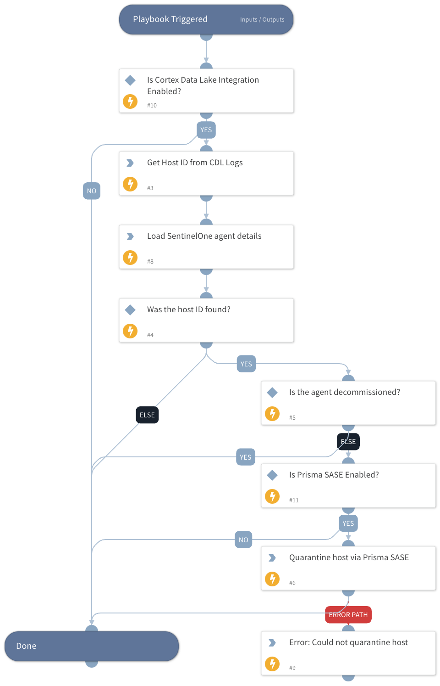

## Goal
This playbook is designed to automatically quarantine a SentinelOne host in response to a new threat incident trigger using Prisma SASE.

## Playbook Flow
- **Trigger**: The playbook activates upon the creation of a new SentinelOne Threat incident.
- **Process**:
  1. Retrieves the Host ID from Cortex Data Lake.
  2. Loads detailed information about the agent.
  3. If the Host ID is found and the agent is not decommissioned, it initiates quarantine through Prisma SASE.

## Dependencies and Configuration
- This playbook requires being set as the default in the SentinelOne instance configuration.
- It specifically responds to events categorized as 'Threats'.
- Ensure that the Prisma SASE, Cortex Data Lake and SentinelOne integrations are properly configured and operational for seamless execution of this playbook.

## Dependencies

This playbook uses the following sub-playbooks, integrations, and scripts.

### Sub-playbooks

This playbook does not use any sub-playbooks.

### Integrations

* PrismaSASE

### Scripts

* PrintErrorEntry
* LoadJSON
* IsIntegrationAvailable

### Commands

* prisma-sase-quarantine-host
* cdl-query-logs

## Playbook Inputs

---
There are no inputs for this playbook.

## Playbook Outputs

---
There are no outputs for this playbook.

## Playbook Image

---

