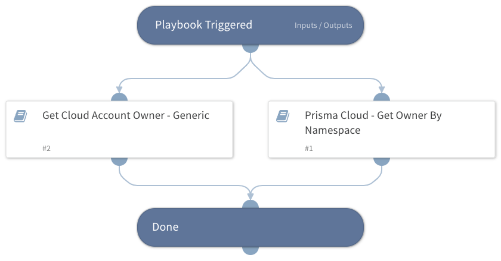

Retrieves the details of the owner of a given cloud account from the following playbooks:
  - Get Cloud Account Owner - Generic
  - Prisma Cloud - Get Owner By Namespace

## Dependencies

This playbook uses the following sub-playbooks, integrations, and scripts.

### Sub-playbooks

* Get Cloud Account Owner - Generic
* Prisma Cloud - Get Owner By Namespace

### Integrations

This playbook does not use any integrations.

### Scripts

This playbook does not use any scripts.

### Commands

This playbook does not use any commands.

## Playbook Inputs

---

| **Name** | **Description** | **Default Value** | **Required** |
| --- | --- | --- | --- |
| AccountID | The account ID to search the owner for. |  | Optional |
| Namespace | The namespace that the playbook would search associated users with. |  | Optional |
| Provider | The account CSP. Available options: - PrismaCloud - GCP |  | Optional |
| EnrichUsers | Whether to enrich found users or not. | False | Optional |

## Playbook Outputs

---

| **Path** | **Description** | **Type** |
| --- | --- | --- |
| PrismaCloud.Users | Prisma Cloud users. | unknown |
| PrismaCloud.Users.email | Prisma Cloud user email. | unknown |
| PrismaCloud.Users.firstName | User first name. | unknown |
| PrismaCloud.Users.lastName | User last name. | unknown |
| PrismaCloud.Users.enabled | User enabled. | unknown |
| PrismaCloud.Users.username | User username. | unknown |
| PrismaCloud.Users.type | User type. | unknown |
| PrismaCloud.Users.displayName | User display name. | unknown |
| CloudAccountOwner | The owner's email, if found. | unknown |
| PrismaCloud.UserRoles.associatedUsers | User roles associated users. | unknown |

## Playbook Image

---

