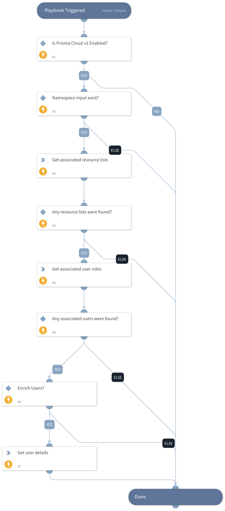

This playbook will retrieve the potential owners of a runtime audit alert.
This id done using the "Namespace" value of the incident in order to query associated resource lists and user roles with associated users.
Eventually the playbook returns a list of user objects (if found).

## Dependencies

This playbook uses the following sub-playbooks, integrations, and scripts.

### Sub-playbooks

This playbook does not use any sub-playbooks.

### Integrations

PrismaCloudV2

### Scripts

IsIntegrationAvailable

### Commands

* prisma-cloud-user-roles-list
* prisma-cloud-users-list
* prisma-cloud-resource-list

## Playbook Inputs

---

| **Name** | **Description** | **Default Value** | **Required** |
| --- | --- | -- | --- |
| Namespace | The namespace that the playbook would search associated users with. | | Optional |
| EnrichUsers | Whether to enrich found users or not. | False | Optional |

## Playbook Outputs

---

| **Path** | **Description** | **Type** |
| --- | --- | --- |
| PrismaCloud.Users | The users which were found by this playbook. | unknown |
| PrismaCloud.Users.email | Prisma Cloud user email. | unknown |
| PrismaCloud.Users.firstName | User first name. | unknown |
| PrismaCloud.Users.lastName | User last name. | unknown |
| PrismaCloud.Users.enabled | User enabled. | unknown |
| PrismaCloud.Users.username | User username. | unknown |
| PrismaCloud.Users.type | User type. | unknown |
| PrismaCloud.Users.displayName | User display name. | unknown |
| PrismaCloud.UserRoles.associatedUsers | User roles associated users. | unknown |

## Playbook Image

---

