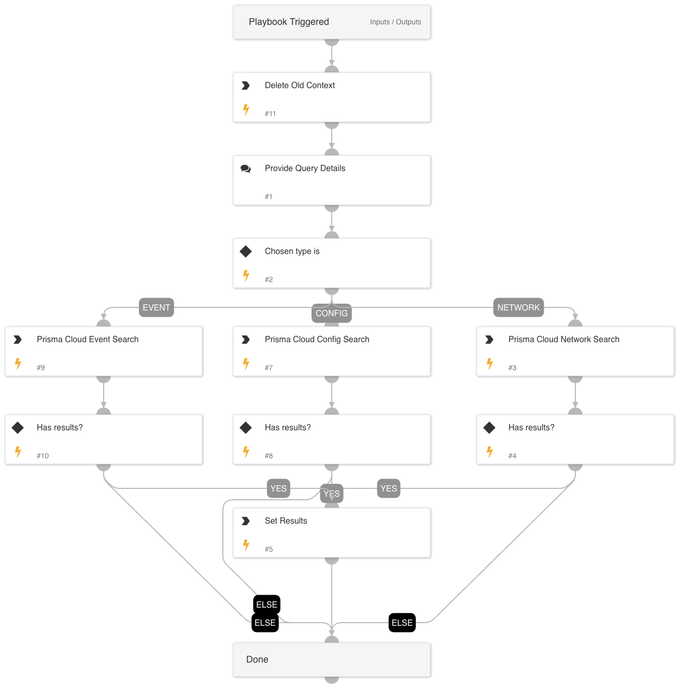

This playbook enables Prisma Cloud RQL Execution from the alert layout.

## Dependencies

This playbook uses the following sub-playbooks, integrations, and scripts.

### Sub-playbooks

This playbook does not use any sub-playbooks.

### Integrations

PrismaCloudV2

### Scripts

* DeleteContext
* JsonToTable

### Commands

* prisma-cloud-event-search
* prisma-cloud-config-search
* prisma-cloud-network-search

## Playbook Inputs

---
There are no inputs for this playbook.

## Playbook Outputs

---
There are no outputs for this playbook.

## Playbook Image

---

