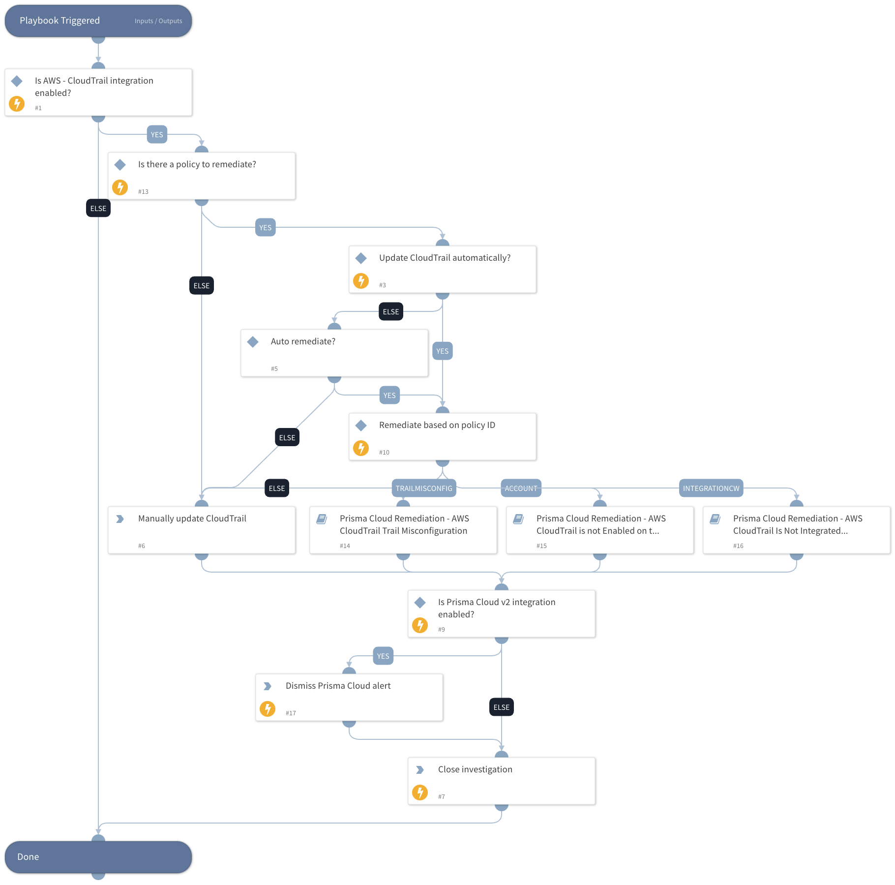

This playbook remediates Prisma Cloud AWS CloudTrail alerts.  It calls sub-playbooks that perform the actual remediation steps.

Remediation:
 - AWS CloudTrail Trail Log Validation Is Not Enabled In All Regions
 - AWS CloudTrail is not enabled in all regions
 - AWS CloudTrail Trail Is Not Integrated With CloudWatch Logs
 - AWS CloudTrail is not enabled on the account

## Dependencies

This playbook uses the following sub-playbooks, integrations, and scripts.

### Sub-playbooks

* Prisma Cloud Remediation - AWS CloudTrail is not Enabled on the Account
* Prisma Cloud Remediation - AWS CloudTrail Is Not Integrated With CloudWatch Logs
* Prisma Cloud Remediation - AWS CloudTrail Trail Misconfiguration

### Integrations

PrismaCloud v2

### Scripts

This playbook does not use any scripts.

### Commands

* prisma-cloud-alert-dismiss
* closeInvestigation

## Playbook Inputs

---

| **Name** | **Description** | **Default Value** | **Required** |
| --- | --- | --- | --- |
| AutoUpdateCloudTrail | Update AWS CloudTrail automatically? | no | Optional |
| policyId | Get the Prisma Cloud policy ID. | incident.labels.policy | Optional |

## Playbook Outputs

---
There are no outputs for this playbook.

## Playbook Image

---

