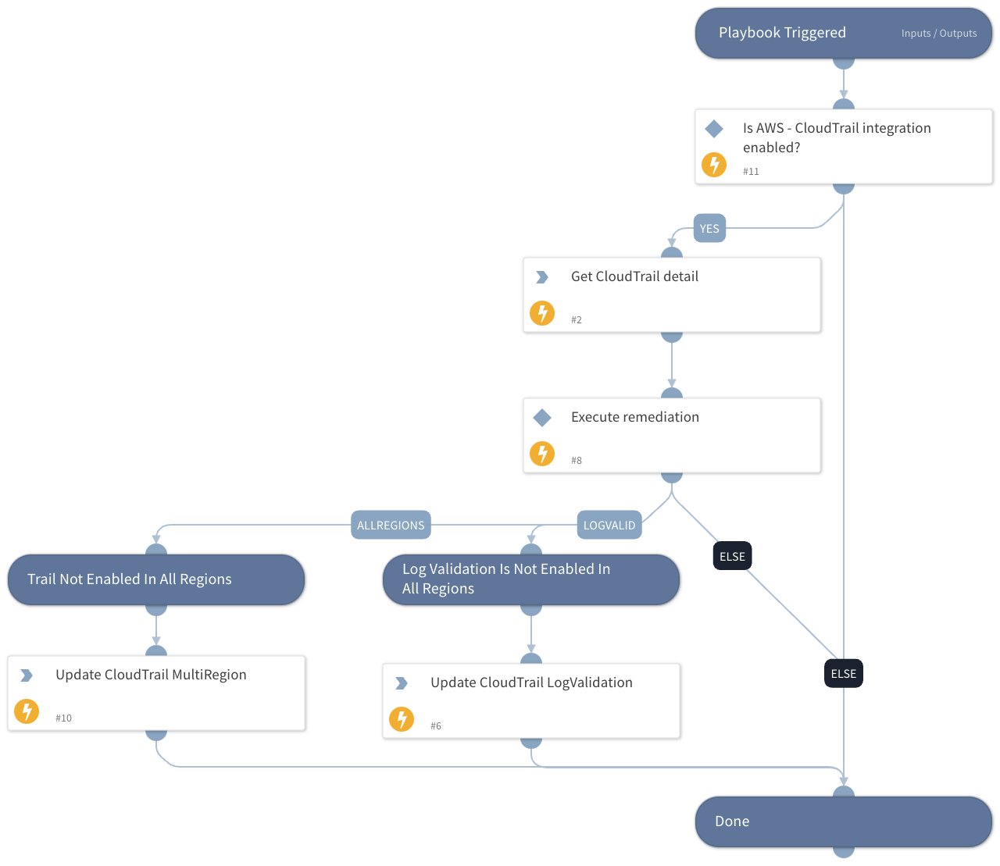

This playbook remediates the following Prisma Cloud AWS CloudTrail alerts.

Prisma Cloud policies remediated:

 - AWS CloudTrail Trail Log Validation Is Not Enabled In All Regions
 - AWS CloudTrail is not enabled in all regions.

## Dependencies

This playbook uses the following sub-playbooks, integrations, and scripts.

### Sub-playbooks

This playbook does not use any sub-playbooks.

### Integrations

* AWS - CloudTrail

### Scripts

This playbook does not use any scripts.

### Commands

* aws-cloudtrail-update-trail
* aws-cloudtrail-describe-trails

## Playbook Inputs

---

| **Name** | **Description** | **Default Value** | **Required** |
| --- | --- | --- | --- |
| policyId | Grab the Prisma Cloud policy Id. |  | Required |

## Playbook Outputs

---
There are no outputs for this playbook.

## Playbook Image

---

