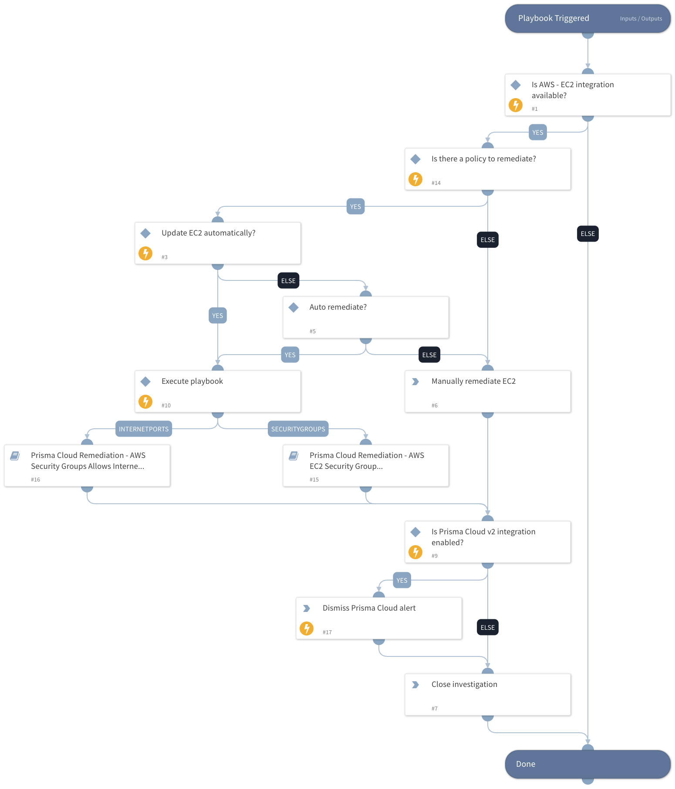

This playbook remediates Prisma Cloud AWS EC2 alerts.  It calls the following sub-playbooks to perform the remediation:
- AWS Default Security Group Does Not Restrict All Traffic (policy id: 2378dbf4-b104-4bda-9b05-7417affbba3f)
- AWS Security Group allows all traffic on SSH port (22) (policy id: 617b9138-584b-4e8e-ad15-7fbabafbed1a)
- AWS Security Groups allow internet traffic from internet to RDP port (3389) (policy id: b82f90ce-ed8b-4b49-970c-2268b0a6c2e5).

## Dependencies

This playbook uses the following sub-playbooks, integrations, and scripts.

### Sub-playbooks

* Prisma Cloud Remediation - AWS Security Groups Allows Internet Traffic To TCP Port
* Prisma Cloud Remediation - AWS EC2 Security Group Misconfiguration

### Integrations

* PrismaCloud v2

### Scripts

* IsIntegrationAvailable

### Commands

* closeInvestigation
* prisma-cloud-alert-dismiss

## Playbook Inputs

---

| **Name** | **Description** | **Default Value** | **Required** |
| --- | --- | --- | --- |
| AutoUpdateEC2 | Update AWS EC2 instance automatically? | no | Optional |
| policyId | Get the Prisma Cloud policy ID. | incident.labels.policy | Optional |

## Playbook Outputs

---
There are no outputs for this playbook.

## Playbook Image

---

