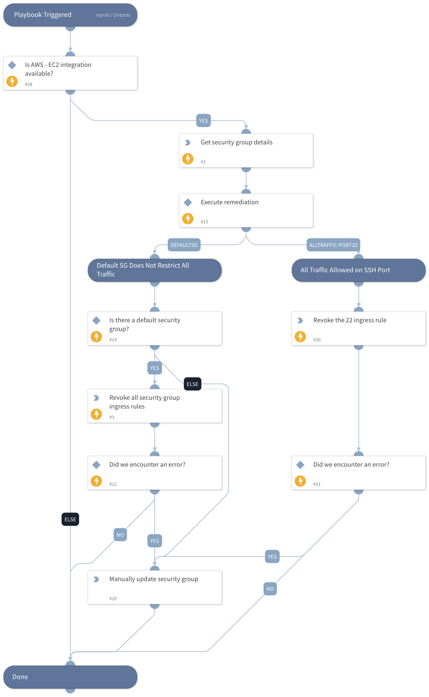

Remediates the Prisma Cloud AWS EC2 alerts generated by the following policies:
 - AWS Default Security Group Does Not Restrict All Traffic
 - AWS Security Groups Allow Internet Traffic
 - AWS Security Groups With Inbound Rule Overly Permissive To All Traffic
 - AWS Security Group allows all traffic on SSH port (22)

## Dependencies
This playbook uses the following sub-playbooks, integrations, and scripts.

### Sub-playbooks
This playbook does not use any sub-playbooks.

### Integrations
This playbook does not use any integrations.

### Scripts
* isError
* Sleep

### Commands
* aws-ec2-revoke-security-group-ingress-rule
* aws-ec2-describe-security-groups

## Playbook Inputs
---

| **Name** | **Description** | **Required** |
| --- | --- | --- |
| policyId | Returns the Prisma Cloud policy ID. | Required |

## Playbook Outputs
---
There are no outputs for this playbook.

## Playbook Image
---

