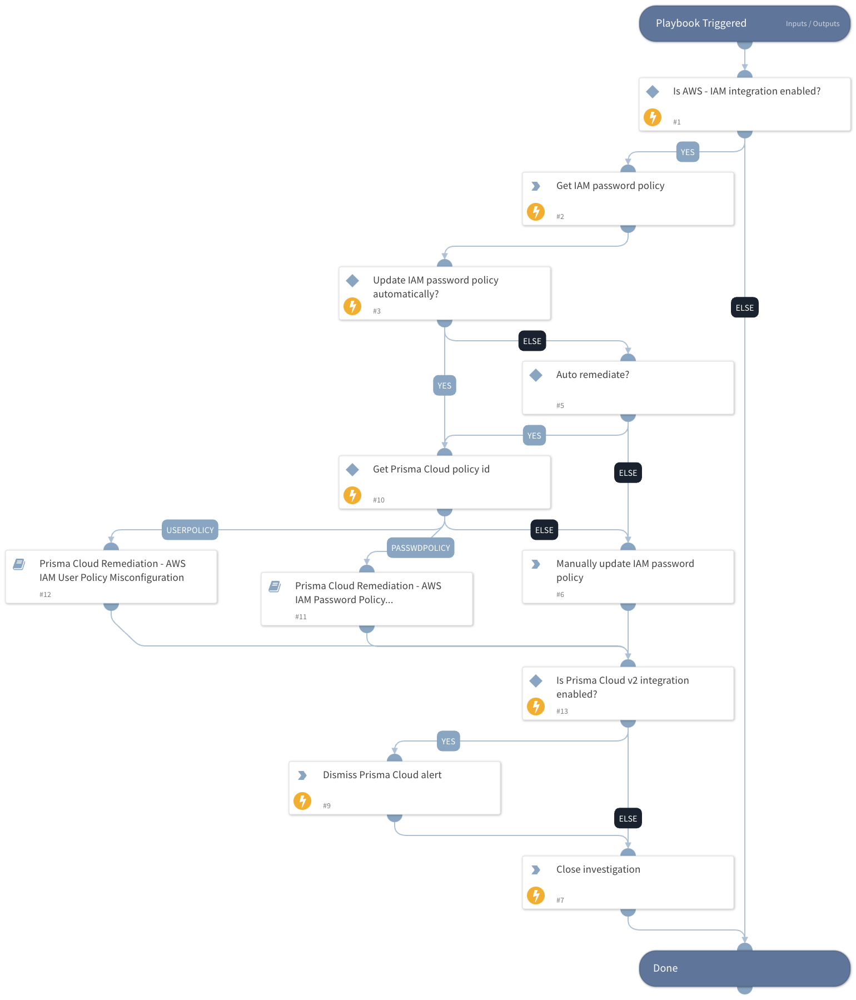

This playbook remediates Prisma Cloud AWS IAM policy alerts. It uses sub-playbooks that perform the remediation steps.

## Dependencies

This playbook uses the following sub-playbooks, integrations, and scripts.

### Sub-playbooks

* Prisma Cloud Remediation - AWS IAM Password Policy Misconfiguration
* Prisma Cloud Remediation - AWS IAM User Policy Misconfiguration

### Integrations

* PrismaCloudV2

### Scripts

This playbook does not use any scripts.

### Commands

* aws-iam-get-account-password-policy
* prisma-cloud-alert-dismiss
* closeInvestigation

## Playbook Inputs

---

| **Name** | **Description** | **Default Value** | **Required** |
| --- | --- | --- | --- |
| AutoUpdatePasswordPolicy | Update AWS IAM password policy automatically? | no | Optional |
| policyId | Get the Prisma Cloud policy ID. | incident.labels.policy | Optional |

## Playbook Outputs

---
There are no outputs for this playbook.

## Playbook Image

---

