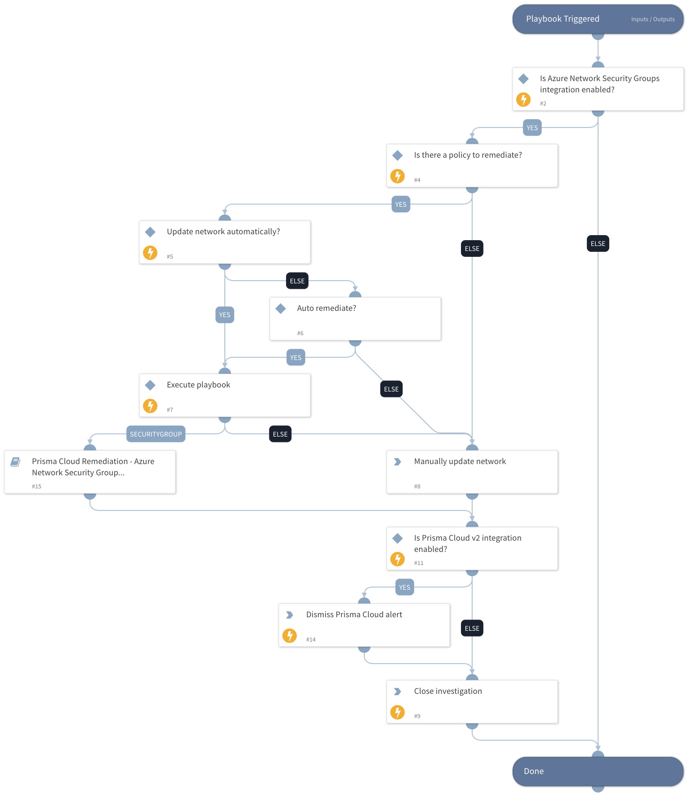

This playbook remediates Prisma Cloud Azure Network alerts.  It calls sub-playbooks that perform the actual remediation steps.

Remediation:

- Azure Network Security Group (NSG) having Inbound rule overly permissive to allow all traffic from any source on any protocol
- Azure Network Security Group (NSG) having Inbound rule overly permissive to allow all traffic from any source on TCP protocol
- Azure Network Security Group (NSG) having Inbound rule overly permissive to allow all traffic from any source on UDP protocol
- Azure Network Security Group (NSG) allows SSH traffic from internet on port 22
- Azure Network Security Group (NSG) allows traffic from internet on port 3389
- Azure Network Security Group allows DNS (TCP Port 53)
- Azure Network Security Group allows FTP (TCP Port 21)
- Azure Network Security Group allows FTP-Data (TCP Port 20)
- Azure Network Security Group allows MSQL (TCP Port 4333)
- Azure Network Security Group allows MySQL (TCP Port 3306)
- Azure Network Security Group allows Windows RPC (TCP Port 135)
- Azure Network Security Group allows Windows SMB (TCP Port 445)
- Azure Network Security Group allows PostgreSQL (TCP Port 5432)
- Azure Network Security Group allows SMTP (TCP Port 25)
- Azure Network Security Group allows SqlServer (TCP Port 1433)
- Azure Network Security Group allows Telnet (TCP Port 23)
- Azure Network Security Group allows VNC Listener (TCP Port 5500)
- Azure Network Security Group allows all traffic on ICMP (Ping)
- Azure Network Security Group allows CIFS (UDP Port 445)
- Azure Network Security Group allows NetBIOS (UDP Port 137)
- Azure Network Security Group allows NetBIOS (UDP Port 138)
- Azure Network Security Group allows SQLServer (UDP Port 1434)
- Azure Network Security Group allows DNS (UDP Port 53)

## Dependencies

This playbook uses the following sub-playbooks, integrations, and scripts.

### Sub-playbooks

Prisma Cloud Remediation - Azure Network Security Group Misconfiguration

### Integrations

PrismaCloud v2

### Scripts

IsIntegrationAvailable

### Commands

* closeInvestigation
* prisma-cloud-alert-dismiss

## Playbook Inputs

---

| **Name** | **Description** | **Default Value** | **Required** |
| --- | --- | --- | --- |
| AutoRemediateAzureNetwork | Execute Azure Network remediation automatically? | no | Optional |
| policyId | Grab the Prisma Cloud policy ID. | incident.labels.policy | Optional |
| portNumber | Port number. | incident | Optional |

## Playbook Outputs

---

| **Path** | **Description** | **Type** |
| --- | --- | --- |
| incident.resourcename | Security group name. | string |

## Playbook Image

---

