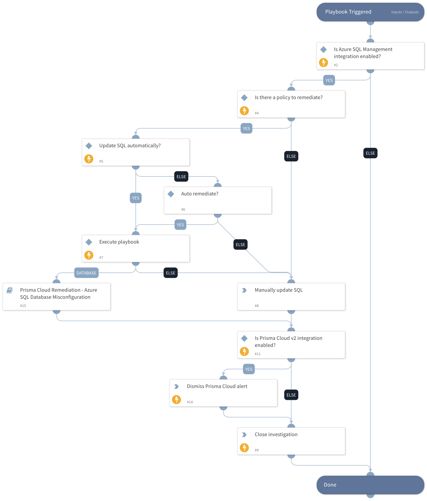

This playbook remediates Prisma Cloud Azure SQL alerts.  It calls sub-playbooks that perform the actual remediation steps.

Remediation:

- Azure SQL database auditing is disabled
- Azure SQL Database with Auditing Retention less than 90 days
- Azure Threat Detection on SQL databases is set to Off
- Azure SQL Database with Threat Retention less than or equals to 90 days

## Dependencies

This playbook uses the following sub-playbooks, integrations, and scripts.

### Sub-playbooks

Prisma Cloud Remediation - Azure SQL Database Misconfiguration

### Integrations

PrismaCloud v2

### Scripts

IsIntegrationAvailable

### Commands

* prisma-cloud-alert-dismiss
* closeInvestigation

## Playbook Inputs

---

| **Name** | **Description** | **Default Value** | **Required** |
| --- | --- | --- | --- |
| AutoRemediateAzureSQL | Execute Azure SQL remediation automatically? | no | Optional |
| policyId | Grab the Prisma Cloud policy ID. | incident.labels.policy | Optional |

## Playbook Outputs

---
There are no outputs for this playbook.

## Playbook Image

---

