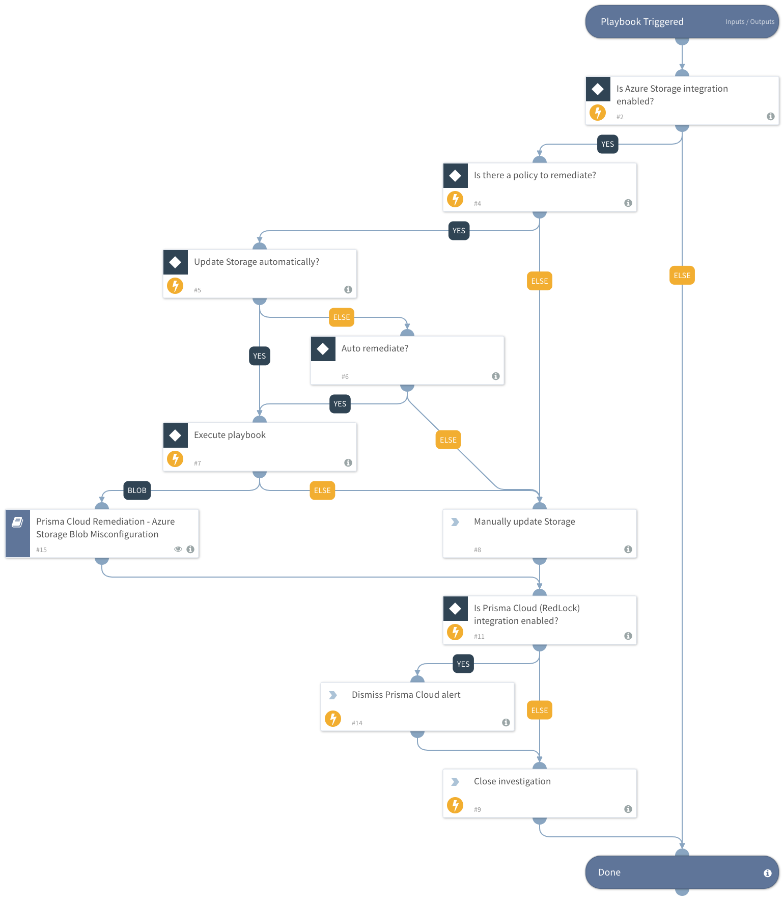

This playbook remediates Prisma Cloud Azure Storage alerts.  It calls sub-playbooks that perform the actual remediation steps.

Remediation:

- Azure storage account has a blob container with public access
- Azure storage account logging for blobs is disabled
- Azure Storage Accounts without Secure transfer enabled
- Azure storage account logging for queues is disabled
- Azure storage account logging for tables is disabled #95

## Dependencies
This playbook uses the following sub-playbooks, integrations, and scripts.

### Sub-playbooks
* Prisma Cloud Remediation - Azure Storage Blob Misconfiguration

### Integrations
* PrismaCloud v2

### Scripts
* IsIntegrationAvailable

### Commands
* closeInvestigation
* redlock-dismiss-alerts

## Playbook Inputs
---

| **Name** | **Description** | **Default Value** | **Required** |
| --- | --- | --- | --- |
| AutoRemediateAzureStorage | Execute Azure Storage remediation automatically? | no | Optional |
| policyId | Grab the Prisma Cloud policy Id. | incident.labels.policy | Optional |

## Playbook Outputs
---
There are no outputs for this playbook.

## Playbook Image
---

