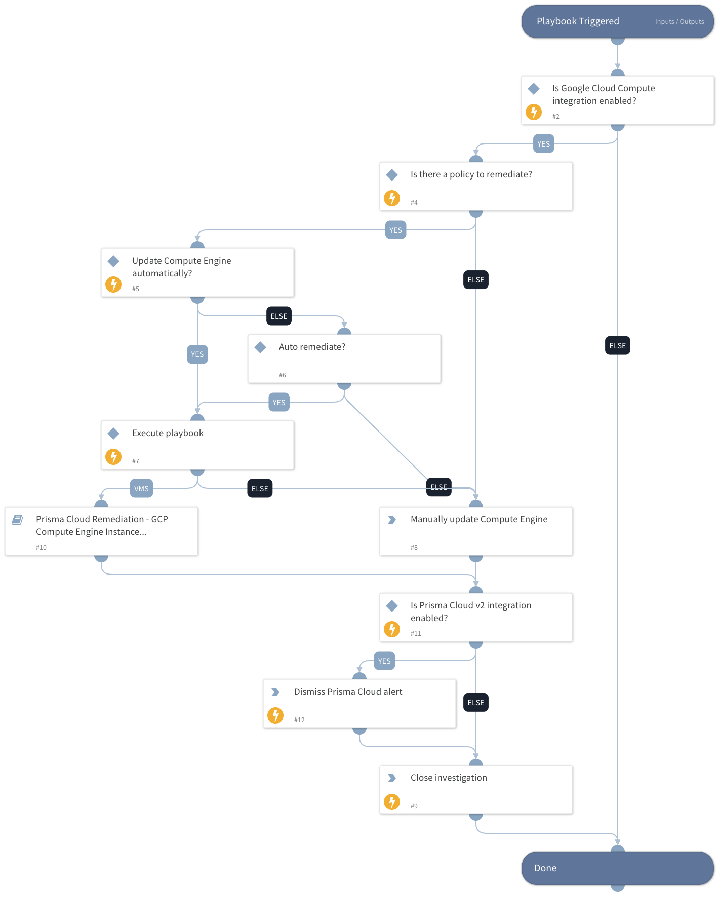

This playbook remediates Prisma Cloud GCP Compute Engine alerts.  It calls sub-playbooks that perform the actual remediation steps.

Remediation:
 - GCP VM instances have serial port access enabled
 - GCP VM instances have block project-wide SSH keys feature disabled
 - GCP VM instances without any custom metadata information

## Dependencies

This playbook uses the following sub-playbooks, integrations, and scripts.

### Sub-playbooks

Prisma Cloud Remediation - GCP Compute Engine Instance Misconfiguration

### Integrations

PrismaCloud v2

### Scripts

This playbook does not use any scripts.

### Commands

* closeInvestigation
* prisma-cloud-alert-dismiss

## Playbook Inputs

---

| **Name** | **Description** | **Default Value** | **Required** |
| --- | --- | --- | --- |
| AutoRemediateComputeEngine | Execute GCP Compute Engine remediation automatically? | no | Optional |
| policyId | Grab the Prima Cloud policy ID. | incident.labels.policy | Optional |

## Playbook Outputs

---
There are no outputs for this playbook.

## Playbook Image

---

