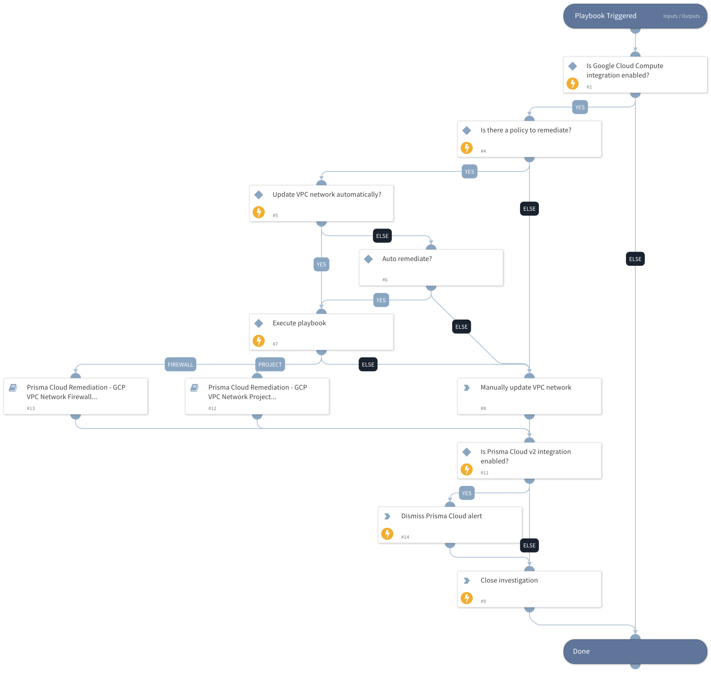

This playbook remediates Prisma Cloud GCP VPC Network alerts.  It calls sub-playbooks that perform the actual remediation steps.

Remediation:

 - GCP project is using the default network
 - GCP Firewall rule allows internet traffic to FTP port (21)
 - GCP Firewall rule allows internet traffic to HTTP port (80)
 - GCP Firewall rule allows internet traffic to MongoDB port (27017)
 - GCP Firewall rule allows internet traffic to MySQL DB port (3306)
 - GCP Firewall rule allows internet traffic to Oracle DB port (1521)
 - GCP Firewall rule allows internet traffic to PostgreSQL port (5432)
 - GCP Firewall rule allows internet traffic to RDP port (3389)
 - GCP Firewall rule allows internet traffic to SSH port (22)
 - GCP Firewall rule allows internet traffic to Telnet port (23)
 - GCP Firewall rule allows internet traffic to DNS port (53)
 - GCP Firewall rule allows internet traffic to Microsoft-DS port (445)
 - GCP Firewall rule allows internet traffic to NetBIOS-SSN port (139)
 - GCP Firewall rule allows internet traffic to POP3 port (110)
 - GCP Firewall rule allows internet traffic to SMTP port (25)
 - GCP Default Firewall rule should not have any rules (except http and https)
 - GCP Firewall with Inbound rule overly permissive to All Traffic

## Dependencies

This playbook uses the following sub-playbooks, integrations, and scripts.

### Sub-playbooks

* Prisma Cloud Remediation - GCP VPC Network Firewall Misconfiguration
* Prisma Cloud Remediation - GCP VPC Network Project Misconfiguration

### Integrations
* Builtin
* PrismaCloud v2

### Scripts

This playbook does not use any scripts.

### Commands

* prisma-cloud-alert-dismiss
* closeInvestigation

## Playbook Inputs

---

| **Name** | **Description** | **Default Value** | **Required** |
| --- | --- | --- | --- |
| AutoRemediateVPCNetwork | Execute GCP Compute Engine remediation automatically? | no | Optional |
| policyId | Grab the Prisma Cloud policy ID. | incident.labels.policy | Optional |

## Playbook Outputs

---
There are no outputs for this playbook.

## Playbook Image

---

