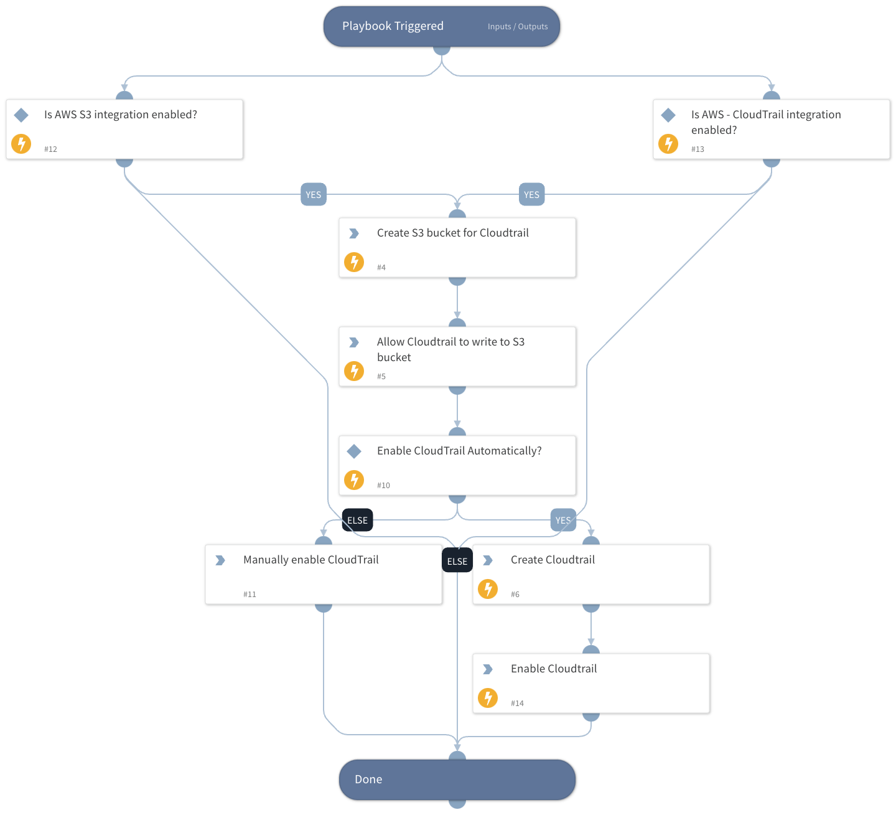

AWS Cloudtrail is a service which provides event history of your AWS account activity, including actions taken through the AWS Management Console, AWS SDKs, command line tools, and other AWS services. To remediate Prisma Cloud Alert "CloudTrail is not enabled on the account", this playbook creates an S3 bucket to host Cloudtrail logs and enable Cloudtrail (includes all region events and global service events).

## Dependencies

This playbook uses the following sub-playbooks, integrations, and scripts.

### Sub-playbooks

This playbook does not use any sub-playbooks.

### Integrations

This playbook does not use any integrations.

### Scripts

This playbook does not use any scripts.

### Commands

* aws-s3-put-bucket-policy
* aws-cloudtrail-start-logging
* aws-cloudtrail-create-trail
* aws-s3-create-bucket

## Playbook Inputs

---

| **Name** | **Description** | **Default Value** | **Required** |
| --- | --- | --- | --- |
| AutoEnableCloudTrail | The following resources will be created: - S3 bucket cloudtrail-&lt;account_id&gt; - Cloudtrail cloudtrail-&lt;account_id&gt;  Type 'Yes' to auto-enable CloudTrail. | No | Optional |
| CloudTrailRegion | S3 bucket and \(global\) Cloudtrail will be created on this region | us-west-2 | Optional |

## Playbook Outputs

---
There are no outputs for this playbook.

## Playbook Image

---

