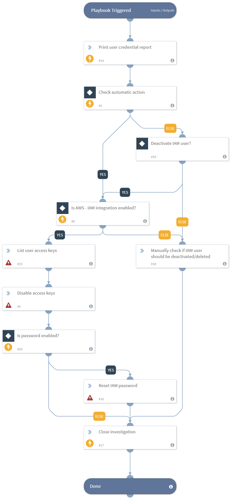

Remediates Prisma Cloud Alert inactive users for more than 30 days, this playbook deactivates the user by disabling the access keys (marking them as inactive) as well as resetting the user console password.

To increase the security of your AWS account, it is recommended to find and remove IAM user credentials (passwords, access keys) that have not been used within a specified period of time.

## Dependencies
This playbook uses the following sub-playbooks, integrations, and scripts.

### Sub-playbooks
This playbook does not use any sub-playbooks.

### Integrations
* Builtin

### Scripts
* Print

### Commands
* aws-iam-update-login-profile
* closeInvestigation
* aws-iam-list-access-keys-for-user
* aws-iam-update-access-key

## Playbook Inputs
---

| **Name** | **Description** | **Default Value** | **Required** |
| --- | --- | --- | --- | 
| AutoQuarantine | Can be, "yes" - access keys will be disabled and password reset, or "no" - an analyst will be prompted for action. | no | Required |

## Playbook Outputs
---
There are no outputs for this playbook.

## Playbook Image
---
 
