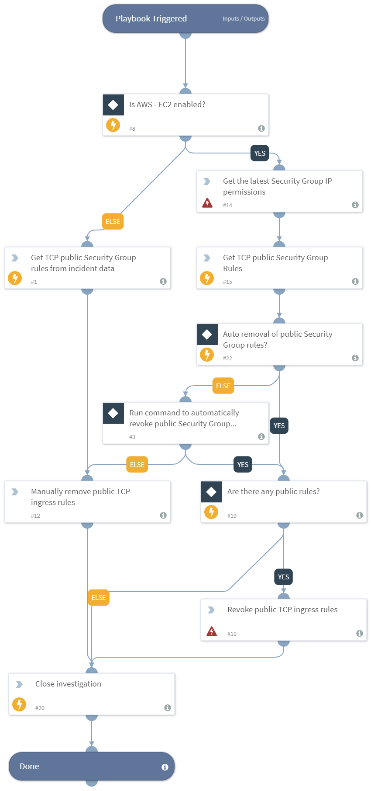

Extracts the TCP public Security Groups rule and provides manual/automatic options to have the rules revoked.

## Dependencies
This playbook uses the following sub-playbooks, integrations, and scripts.

### Sub-playbooks
This playbook does not use any sub-playbooks.

### Integrations
* Builtin
* AWS - EC2

### Scripts
* AwsEC2GetPublicSGRules

### Commands
* aws-ec2-revoke-security-group-ingress-rule
* aws-ec2-describe-security-groups
* closeInvestigation

## Playbook Inputs
---

| **Name** | **Description** | **Default Value** | **Required** |
| --- | --- | --- | --- | 
| AutoRevokeRule | Can be, "yes" - public security group rules will be automatically revoked, or "no" - analyst will be prompted whether or not to allow automatic removal of the rules.  | no | Required |

## Playbook Outputs
---
There are no outputs for this playbook.

## Playbook Image
---

