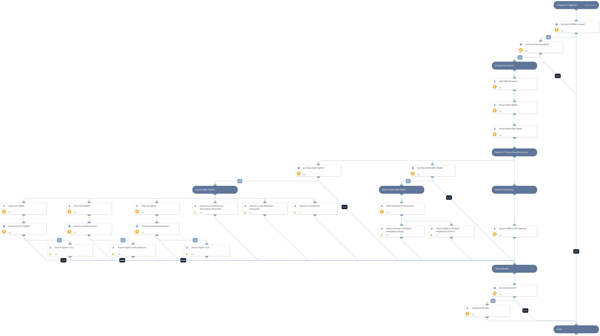

Find AWS resources by FQDN using Prisma Cloud inventory.
Supported services: EC2, Application Load Balancer, ECS, Route53, CloudFront, S3, API Gateway.

## Dependencies

This playbook uses the following sub-playbooks, integrations, and scripts.

### Sub-playbooks

This playbook does not use any sub-playbooks.

### Integrations

PrismaCloud v2

### Scripts

* PrismaCloudAttribution
* SetAndHandleEmpty

### Commands

prisma-cloud-config-search

## Playbook Inputs

---

| **Name** | **Description** | **Default Value** | **Required** |
| --- | --- | --- | --- |
| FQDN | FQDN to look up |  | Required |
| AWSDomains | A comma-separated list of AWS domains. | .amazonaws.com,.cloudfront.net | Optional |

## Playbook Outputs

---

| **Path** | **Description** | **Type** |
| --- | --- | --- |
| PrismaCloud.Attribution | Prisma Cloud attributed asset information. | unknown |

## Playbook Image

---

