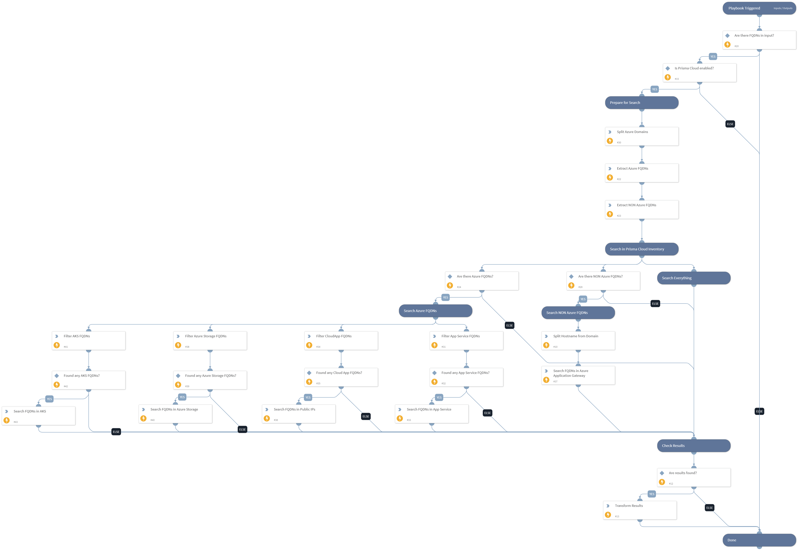

Find Azure resources by FQDN using Prisma Cloud inventory.
Supported services: Azure VM, Azure Load Balancer, Azure Application Gateway, AKS, Azure Web Apps, Azure Storage.

Supported Cortex XSOAR versions: 6.0.0 and later.

## Dependencies
This playbook uses the following sub-playbooks, integrations, and scripts.

### Sub-playbooks
This playbook does not use any sub-playbooks.

### Integrations
* PrismaCloud v2

### Scripts
This playbook does not use any scripts.

### Commands
* redlock-search-config

## Playbook Inputs
---

| **Name** | **Description** | **Default Value** | **Required** |
| --- | --- | --- | --- |
| FQDN | FQDN to look up |  | Required |
| AzureDomains | Azure domains \(comma separated\) | .azure.com,.azurewebsites.net,.windows.net,.azmk8s.io | Optional |

## Playbook Outputs
---

| **Path** | **Description** | **Type** |
| --- | --- | --- |
| PrismaCloud.Attribution | Prisma Cloud attributed asset information. | unknown |

## Playbook Image
---
