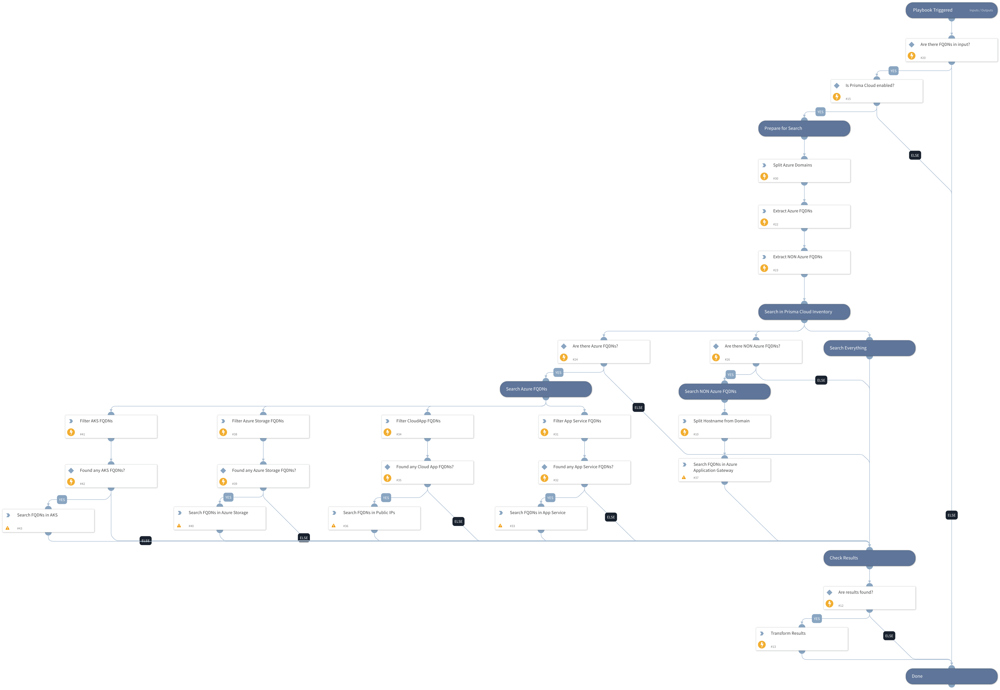

Find Azure resources by FQDN using Prisma Cloud inventory.
Supported services: Azure VM, Azure Load Balancer, Azure Application Gateway, AKS, Azure Web Apps, Azure Storage.

## Dependencies

This playbook uses the following sub-playbooks, integrations, and scripts.

### Sub-playbooks

This playbook does not use any sub-playbooks.

### Integrations

PrismaCloud v2

### Scripts

* SetAndHandleEmpty
* PrismaCloudAttribution

### Commands

prisma-cloud-config-search

## Playbook Inputs

---

| **Name** | **Description** | **Default Value** | **Required** |
| --- | --- | --- | --- |
| FQDN | FQDN to look up. |  | Required |
| AzureDomains | A comma-separated list of Azure domains. | .azure.com,.azurewebsites.net,.windows.net,.azmk8s.io | Optional |

## Playbook Outputs

---

| **Path** | **Description** | **Type** |
| --- | --- | --- |
| PrismaCloud.Attribution | Prisma Cloud attributed asset information. | unknown |

## Playbook Image

---

