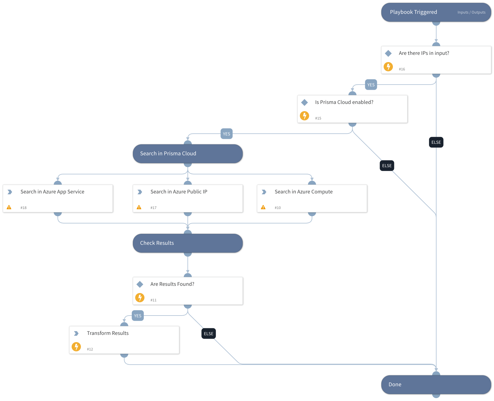

Find Azure resources by Public IP using Prisma Cloud inventory.
Supported services: Azure VM, Azure Load Balancer, Azure Application Gateway, Azure Web Apps.

## Dependencies

This playbook uses the following sub-playbooks, integrations, and scripts.

### Sub-playbooks

This playbook does not use any sub-playbooks.

### Integrations

PrismaCloud v2

### Scripts

PrismaCloudAttribution

### Commands

prisma-cloud-config-search

## Playbook Inputs

---

| **Name** | **Description** | **Default Value** | **Required** |
| --- | --- | --- | --- |
| PublicIPAddress | Public IP address to look up. |  | Required |

## Playbook Outputs

---

| **Path** | **Description** | **Type** |
| --- | --- | --- |
| PrismaCloud.Attribution | Prisma Cloud attributed asset information. | unknown |
| PrismaCloud.Config.data.tags | Prisma Cloud Tags information. | unknown |

## Playbook Image

---

